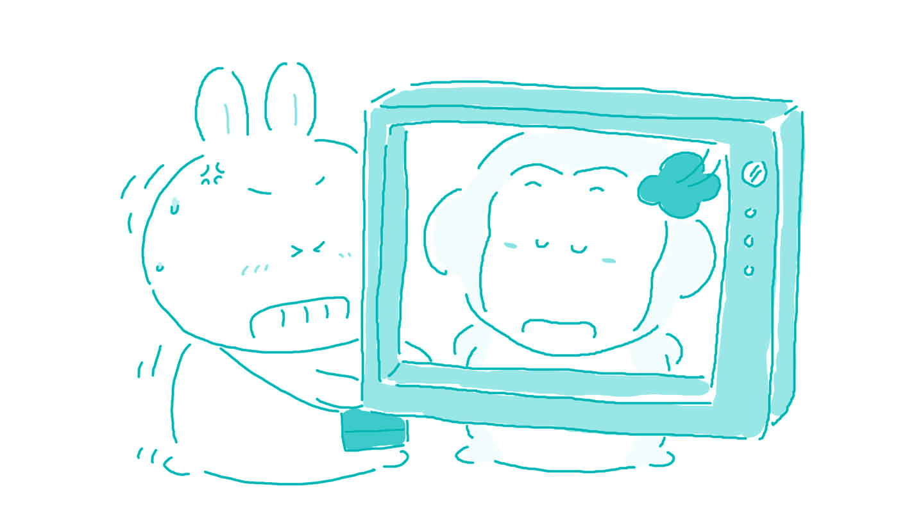

# 007. The influence of movies or television on people's behavior

The impact that movies or television has had on our daily life, and society in general, is undeniable. No doubt it will become even greater as the scope of which continues to grow, and as the relevant technologies become more and more sophisticated, and so fascinating that virtually nobody will be able to escape. Already, it can be seen how western movies are exercising influence on our youth generation: they grow long-hair regardless of their gender, commonly part of which is dyed in gold; they wear jeans in each and every season, usually the knees of which are deliberately tattered; boys are fond of earrings or other odd pendants; and girls are keen on Marlboros and weird bad words.

The major means that movies and television influence the public is by creating topics of discussion in the society. Movies offer people \(the consumers\) issues to talk and think about. Titanic had brought a worldwide uproar by its extolling of fascinating immortal love; Prime Color and Wag the Dog met the national debate on right and duty of the president of the United States. Antiwar movies such as Tears of the Sun and All Quiet on the Western Front among numerous others have been raising the question that is any war really to uphold justice or is it really worthy that an individual makes sacrifices to his country and at the same time ignores his own family or his personal values? Television also shapes our understanding of what is important and what is not important \(to know\). The"important" issues are being discussed over and over or in the beginning of a program. The "not important" stories are the ones that are not being told at all. The"not very important" stories are probably very short and hidden in the last part. By prearranging public issue, movies and television make decisions for us. Even though there are critical thinking individuals in any society, they are definitely in minority; the public in whole indeed lack skills of critical thinking, and therefore they are often led by the movies and television.

In brief, movies and television, by offering topics and affecting the ways in which we discuss"the important issues", has a strong influence on our perception of the truth, of the world or of the structure of our society. We have to admit that it has a role in our lives as a source of information, experiences, entertainment, amusement and relaxation.

> ## 译文
>
> **7. 电影和电视对人们行为的影响**
>
> 电影和电视，对我们的日常生活和总体而言的社会产生的冲击是不可否认的。毫无疑问，随着其范围继续扩展，这一冲击可能会更剧烈，而且随着相关技术变得越来越复杂，越来越令人着迷，没有人能逃脱。现在已经可以看到西方的电影对我们的年轻一代产生了怎样的影响：他们不分性别地蓄起长发，通常还把一部分染成金色；他们不分季节地穿牛仔裤，通常膝盖都弄得破破烂烂；男孩们喜欢耳环或其他奇怪的饰物；女孩们对万宝路香烟和奇怪的脏话青睐有加。
>
> 电影和电视影响公众的主要途径就是制造社会上交谈的话题。电影提供给人（消费者）话题去谈论和思考。《泰坦尼克》用值得赞美和令人迷醉的永恒爱情使世界喧嚣； 《原色》和《摇尾巴的狗》使整个国家都在争论美国总统的权利和责任；像《太阳的眼泪》和《西线无战事》之类无数的反战电影，提出了战争是否真正维持正义或个人为国家牺牲同时忽略他的家庭和他的个人价值是否真正值得的问题。
>
> 电视也在引导我们思考什么是重要的和什么是不重要的。“重要的”问题会多次被讨论或出现在电视节目的开始。“不重要的”故事则根本不说。“不太重要的”故事可能很短或隐藏在最后部分。通过预先安排公众问题，电影和电视替我们做了决定。尽管每个社会都会有持批判思想的个人，但他们肯定是少数；公众整体上确实缺乏批判思维的技巧，于是他们就受电影和电视的引导。
>
> 简而言之，电影和电视通过提供话题和影响我们讨论“重要问题” 的方法，在我们对真相、世界和我们的社会结构的看法上产生强烈的影响。我们不得不承认它们在我们生活中的作用，为我们带来了信息、经验、娱乐、消遣和放松。

## Word List

* mass media n. 大众媒体
* justice ［ˈdʒʌstis］ n. 正义
* relevant ［ˈreləvənt］ adj. 相关的
* issue ［ˈisju:］ n. 问题
* sophisticated ［səˈfistikeitid］ adj. 复杂的
* prearrange ［ˌpri:əˈreindʒ］ vt. 预先安排
* gender ［ˈdʒendə］ n. 性别
* minority ［məˈnɔriti］ n. 少数
* pendant ［ˈpendənt］ n. 垂饰物
* entertainment ［ˌentəˈteinmənt］ n. 娱乐
* tattered ［ˈtætəd］ adj. 破旧的
* amusement ［əˈmju:zmənt］ n. 消遣
* censorship ［ˈsensəʃip］ n. 审查制度

