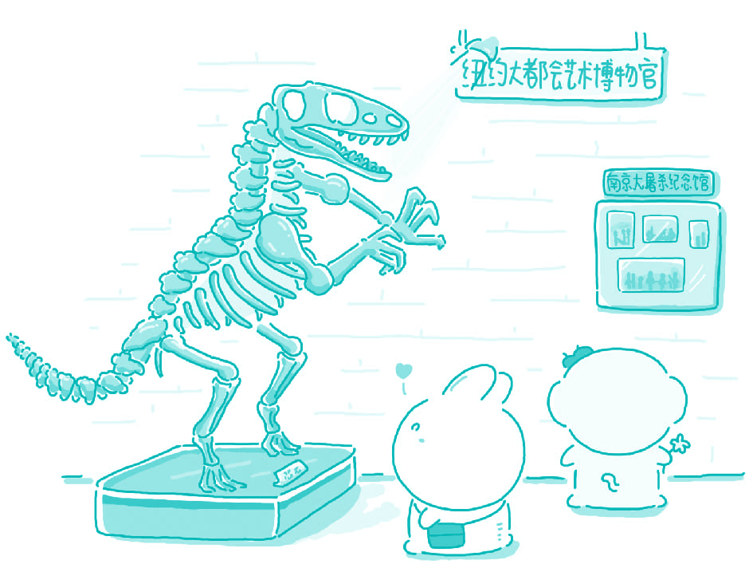

# 012. Why people visit museums?

People travel to new places for many different reasons. One of the most common reasons is to see a new place, culture, or way of life. For a total outsider with only a short amount of time, museums offer a glimpse into these ways of life through specially designed education, cultural insights, and entertainment.

People come to museums to learn about the world. The educational experience in a museum is quite different than that of reading or studying. In a museum, learning experiences are direct and thrilling. Reading books about primitive history might seem boring, but seeing the huge skeleton of a terrifying dinosaur in person is a thrilling experience. Reading history books about the Nanjing Massacre are horrifying, sad, and yet abstract, but a trip to the Memorial Museum in Nanjing is an experience that has moved many students to tears. Museums can make otherwise distant and mundane educational experiences come to life.

The museums of a place tell an outsider much about what the people of that place value culturally. A trip to the New York Metropolitan Museum of Art would tell the visitor that Americans are interested in art from all over the world, but by comparing the size of the European Art collection with that of the Asian Art collection, one might conclude that Americans feel a strong cultural affinity with European Art. Similarly, a tourist to a place like San Francisco, where there is a large museum devoted solely to Asian Art, might conclude that people from San Francisco have a stronger affinity to Asian culture.

Meanwhile, many people who travel simply want to relax and be entertained, and museums also provide an excellent venue for leisure. Even most nominally educational museums provide exciting attractions like movie theaters and special cultural performances such as dances, gourmet dinners, lectures, and musical performances from jazz to rock and roll. Many museums in the United States hold special nights once a week where young people can drink and socialize. Museums are not only spaces for education and culture, but have also become important entertainment and social venues.

> ## 译文
>
> **12. 人们为什么要参观博物馆？**
>
> 人们因为不同的原因去新的地方旅行。最普遍的原因之一就是想看看新的地方、文化和生活方式。对于一个只有很短时间的完全陌生的外地人来说，博物馆通过专门设计的教育、文化视角和娱乐来提供对这些生活方式的一瞥。
>
> 人们参观博物馆是为了了解世界。参观博物馆的教育经历与读书或是学习的经历完全不同。在博物馆中，学习经历是直接且引人入胜的。阅读史前历史的书籍可能是枯燥的，但是亲自到博物馆去看巨大骇人的恐龙骨架却是一种刺激的经历。阅读有关南京大屠杀的史书是令人恐惧、难过但抽象的，而去参观南京大屠杀纪念馆是一次使许多学生感动得落泪的经历。博物馆可以使原本遥远且平凡的教育经历生动起来。
>
> 一个地方的博物馆展示给外地人很多当地的人文价值观。参观一次纽约大都会艺术博物馆可以告诉参观者美国人喜欢来自世界各地的艺术品，但是比较一下欧洲艺术品与亚洲艺术品的收藏规模，你就可以得出欧洲艺术品对美国人有着强烈的文化吸引力。同样地，游览一个像旧金山那样的地方，那里有一个纯为亚洲艺术修建的大型博物馆，你就会感觉旧金山更受亚洲文化的吸引。
>
> 与此同时，很多人旅行仅仅是为了放松和娱乐，博物馆也可以为休闲提供不错的场所。甚至很多名义上是教育性的博物馆也提供比如影院和特色文化表演，包括舞会、美食晚宴、报告会、从爵士乐到摇滚乐的演出等。美国的很多博物馆每周都举行特色晚会，年轻人可以去那里喝酒和进行社交活动。博物馆不仅是进行教育和文化活动的场所，而且已经成为重要的娱乐和社交场所。

## Word List

* outsider ［ˌautˈsaidə］ n. 外人
* massacre ［ˈmæsəkə］ n. 大屠杀
* glimpse ［glimps］ n. 一瞥
* mundane ［mʌnˈdein］ adj. 尘世的，平凡的
* thrilling ［θriliŋ］ adj. 令人激动的
* New York Metropolitan Museum of Art纽约大都会艺术博物馆
* primitive ［ˈprimitiv］ adj. 原始的，上古的
* skeleton ［ˈskelitin］ n. 骨架
* affinity ［əˈfiniti］ n. 喜爱，吸引力
* terrifying ［ˈterəfaiiŋ］ adj. 可怕的
* venue ［ˈvenju:］ n. 场所，地点
* dinosaur ［ˈdainəˌsɔ:］ n. 恐龙

