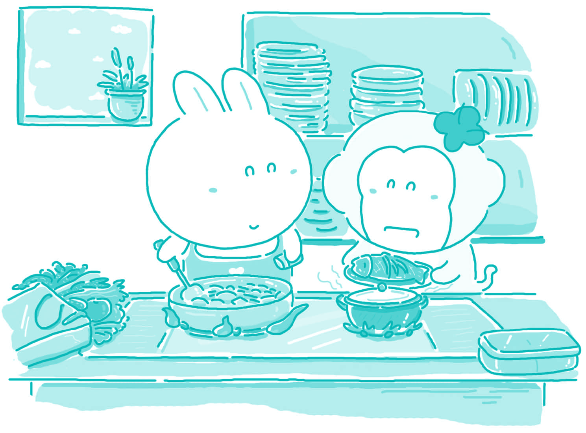

# 013. Eat at home or out?

After a hard day of work or study, many people feel like cooking for themselves is too much trouble. They prefer to grab a quick bite to eat at a restaurant and go home for rest as quickly as possible. But for me cooking at home is worth the time and trouble because it is cheaper, healthier, and more enjoyable.

Buying my own groceries and cooking for myself is much less expensive than eating in a restaurant. I find that a meal that I cook myself on average costs half to two-thirds less than a comparable meal in a restaurant. Restaurants have to rent space, hire chefs, waiters, and managers, as well as buy food and make a profit. When I cook I have no overhead. The only extra expense I have to pay is the time it takes for me to cook the food.

In addition to being less expensive, when I buy my own groceries I can be sure I am buying the freshest and cleanest meats and vegetables available. Restaurants might think it's more important to buy the cheapest food possible in large quantities to make a higher profit. I also try and buy the healthiest food possible. For instance, when I buy meat, I try and buy the meat with the least fat on it. In a restaurant they add more fat and oil to dishes to make them taste better, but for me, health is more important.

Finally, cooking food with my friends and family brings me a special kind of joy. In a world that has increasingly focused on turning everyone into consumers, I enjoy being creative and producing something good. I enjoy learning and inventing new recipes and sharing them with friends. Even though it takes more time to shop, cook, and clean up when I cook for myself, at the end I have a sense that I did not waste the time so much as I truly enjoyed life for an hour at the end of the day.

> ## 译文
>
> **13. 在家吃饭还是外出就餐？**
>
> 经过一天辛苦的工作或学习，很多人觉得亲自下厨过于麻烦。他们更愿意在餐馆里匆匆吃点东西然后尽快回家休息。但是对我来说，花时间费劲在家做饭是值得的，因为这样更便宜、健康、有乐趣。
>
> 自己买菜做饭吃要比在餐馆吃便宜得多。我发现自己做饭平均比餐馆里与之相当的饭菜便宜一半到三分之二。餐馆要租场地，雇厨师、侍者和管理人员，还要购买食品、赢得利润。我做饭就没有那些支出。唯一需要付出的额外代价是做饭所需的时间。
>
> 除了少花钱，我亲自买菜可以确保买到最新鲜干净的肉与菜。餐馆则认为大量买进最便宜的食品赚取更高利润更重要。我也尽量买最有助健康的食物。举例来说，我买肉时尽量挑肥肉最少的肉。而餐馆则在菜中添加更多的肥肉与油以使其风味更佳，可对我来说健康更重要。
>
> 最后，与朋友和家人一起做饭为我带来了特别的快乐。在一个越来越专注于将所有人都变成消费者的世界里，我喜欢创造性地做出一些好东西。我喜欢学习并发明些新的配方与朋友们分享。尽管自己做饭会花更多的时间去购物、烹调和清扫，到最后，在一天的结束之际真正享受了一小时的生活使我感觉自己并没有浪费时间。

## Word List

* grab a quick bite to eat 匆忙地吃点什么
* groceries ［ˈgrəusəriz］ n. 食品杂货
* chef ［ʃef］ n. 厨师
* overhead ［ˈəuvəˌhed］ n. 管理费用
* focused on 集中注意力于
* recipe ［ˈresəˌpi］ n. 配方
* consumer ［kənˈsu:mə］ n. 消费者

