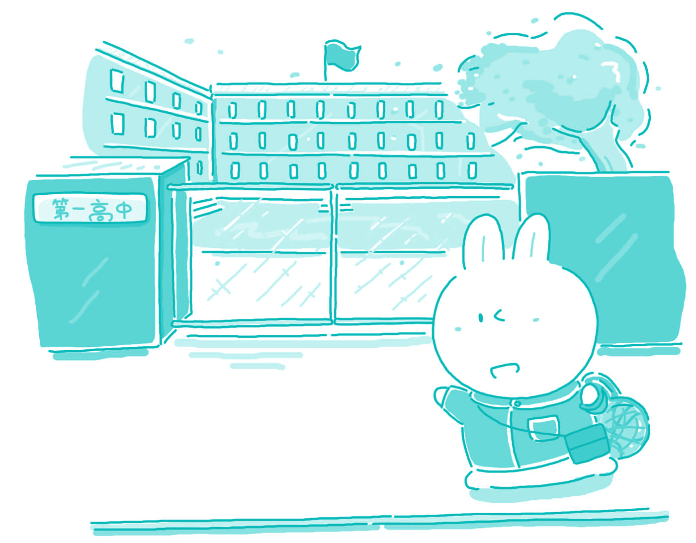

# 030. Do you like a new high school being built in your community?

The basic prerequisite of success for any community is the education of its citizens. Because the advantages of a high school education in my town are presently available to only a limited number of students every year, I wholeheartedly support the construction of a new school facility to serve our community.

The competition to get into high school in my town is fierce. There are three middle schools in town, but only one high school. Because the number of applicants to the single high school far exceeds the available spaces in the high school, only the richest and most qualified students are able to go to school. The skills taught in high school including advanced math, analysis, and high-level reading and writing are important to every citizen, no matter what profession they later choose. Even if they are manual laborers, the ability to critically analyze problems taught in high school will make them better and more highly skilled workers.

Beyond teaching practical skills to more local children, another high school will give children more opportunity to attend college. Holding a college degree is almost the only way a person can be assured of getting a stable, high paying job. Even a degree from a two or three year junior college can mean the ability to make a salary thousands of yuan annually higher than a high school diploma.

Because our current high school is so small, many bright children with promising college careers ahead of them have no way of even obtaining the high school diploma! We must make sure the road to higher education remains open for as many young people as possible.

Finally, if we cannot afford to open this high school, our town will have a serious problem with the number of unemployed youths who graduate from middle school with nothing to do. If they cannot find good jobs, they might be tempted to commit crimes, use drugs, or, if they are girls, engage in prostitution. Giving these children another option would both save them and help society.

> ## 译文
>
> **30. 你赞成在你的社区建一所新的高中吗？**
>
> 任何社区取得成功的先决条件就是对其公民的教育。因为在我们镇里，高中教育的益处目前每年只有有限学生才能享受到，所以我完全支持建立新的学校设施为我们的社区服务。
>
> 在我们镇上进入高中的竞争很激烈。镇里有三所中学，但只有一所高中。因为申请上这所惟一的高中的人数远远超过该校所能容纳的学生数量，所以只有最富裕和成绩最好的学生才能上学。高中里教授的技巧包括高等数学、分析、高等阅读和写作，对任何公民来说，无论他以后选择什么行业，这些技巧都很重要。甚至假如他们是手工业工人，高中里教的批判地分析问题的能力也能使他们成为技术更高超的工人。
>
> 除了向更多的本地孩子传授实用技术，另一所高中还会给孩子们提供更多上大学的机会。持有大学文凭几乎是惟一能保证一个人得到一份稳定的高薪工作的办法。甚至两到三年的大专文凭也意味着能比高中文凭每年多挣几千元。
>
> 因为现在我们的高中太小了，所以很多聪明并有可能考上大学的孩子甚至都无法得到高中文凭！我们必须保证通向高等教育的路向尽可能多的孩子敞开着。
>
> 最后，如果我们花不起钱开办这所学校，我们镇将会有一个严重的问题，那就是大量初中毕业、没有工作的年轻人无事可做。如果他们找不到好的工作，他们就可能受诱惑去犯罪、吸毒，如果是女孩，还可能去卖淫。给这些孩子另外一个选择不仅会救了他们，而且也有益于社会。

## Word List

* prerequisite ［ˈpri:ˈrekwizit］ n. 先决条件
* wholeheartedly ［ˈhəulˈha:tidli］ adv. 全心全意地
* facility ［fəˈsiliti］ n. 设备，工具
* competition ［ka:mpiˈtiʃən］ n. 竞争，竞赛
* applicant ［ˈæplikənt］ n. 申请者，请求者
* exceed ［ikˈsi:d］ vt. 超越，胜过
* qualified ［ˈkwa:lifaid］ adj. 有资格的
* manual ［ˈmænjuəl］ adj. 手工的，体力的
* diploma ［diˈpləumə］ n. 文凭，毕业证书
* promising ［ˈpra:misiŋ］ adj. 有希望的，有前途的
* unemployed ［ˌʌnemˈplɔid］ adj. 失业的
* prostitution ［ˌpra:stiˈtu:ʃən］ n. 卖淫

