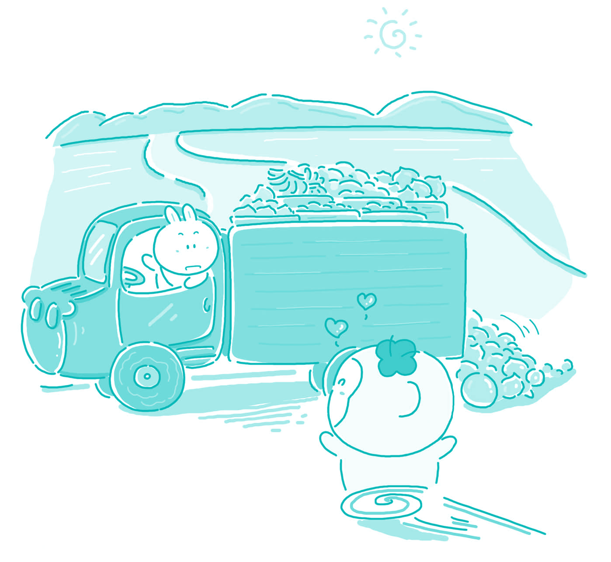

# 036. A transportation vehicle that has changed people's lives

Automobiles, as the exponent of modern transportation vehicles, virtually have contributed to modern life more than most people have imagined, even though automobiles, as is true of all other technologies, have also created many problems.

The advancement of modern transportation, certainly including that of automobiles, has made more goods available in local markets. For example, in China, some fruits are only cultivated in the southern part of the country and not in the northern, such as litchi, sugarcane, pineapple—partly due to sheer gradient of temperature. Thanks to the advancement of modern transportation system, people in the northern part of the country can now get those southern cultivated fruits readily available in almost every local market. In the far past when such system didn't exist, when goods could be transported only by primitive tools such as carts, some fruits such as litchi were the privilege of imperial household.

At the same time, the development of modern transportation has also made goods in local markets much less expensive. Take litchi for example again. Two decades ago, litchi was pretty expensive, and was a luxury. But the development has made the transportation easier and the cost lower and lower. On the other hand, due to previous factors, more merchants are engaged in the business that simultaneously intensified the competition, which certainly affected the prices.

Thus, the price of litchi subsequently dropped. The same goes for other goods as well. Today, people are able to buy almost any goods they want no matter where the origin of the goods is, and to make choice among more counterparts, and the best of all, to take the goods home with less expenditure.

Moreover, advanced transportation vehicles such as automobiles have to some extent made people more independent than before. It is not hard to imagine that 50 years ago a young widow who lived in a small village and whose husband had died when she was 23 had little chance to get married again, for the sake of the tradition or culture, or whatever. But if that happened in the present day, things would be entirely different. Advanced transportation vehicles being readily available, she could easily get to another city within at most 2 days and by lower expenses, say from the small village located in the north east of China to the far southern city, Guangzhou—several thousands of miles away. That's a big city, that's a new city, and nobody knows her there; she has a brand new start, and she is entirely independent.

> ## 译文
>
> **36. 改变人类生活的一种交通工具**
>
> 汽车，作为现代交通工具的代表，对现代生活的贡献远比大多数人能想象到的多。尽管汽车，像其他技术一样，也都带来了一些问题。
>
> 现代交通的进步，当然包括汽车，使地方市场里有更多的商品可供出售。例如在中国，很多水果只在南方种植而北方没有，像荔枝、甘蔗、菠萝——大部分是因为气温的强烈变化。幸亏有了现代交通系统的进步，在北方几乎所有的地方市场都随时拥有南方出产的水果以供销售。很久以前没有这种系统，货物只能通过原始的工具例如大车等来运输，像荔枝这些水果就只能是皇家的特别待遇。
>
> 同时，现代交通的进步也使地方市场里的货物变得更便宜。再次举荔枝作为例子。20年前，荔枝相当贵，而且是一种奢侈品。但是发展使运输变得更简单，花费也越来越低。另一方面，出于前面的原因，更多的商贩同时投身于此行业加剧了竞争，当然也影响了价格。结果，荔枝的价格降了下来。其他的货物也出现了同样的情况。今天，人们几乎可以买到任何他们想要的东西，无论产地是哪里，还可以在更多的竞争者中间挑选，可以更便宜地把东西买回家。

## Word List

* exponent ［ekˈspəunənt］ n. 代表者，典型
* sugarcane ［ˈʃugəkein］ n. 甘蔗，糖蔗
* gradient ［ˈgreidiənt］ adj. 倾斜的
* cultivated ［ˈkʌltəˌveitid］ v. 耕耘，栽植
* previous ［ˈpri:viəs］ adj. 在前的，早先的
* subsequently ［ˈsʌbsiˌkwəntli］ adv. 后来，随后
* counterpart ［ˈkauntəpa:t］ n. 对应物 

