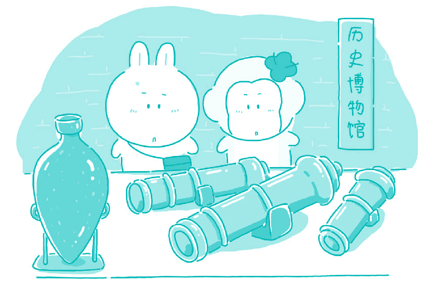

# 038. Does history have any value for people living in the present?

People live in the present. They plan for and worry about the future. History, however, is the study of the past. Some people might ask,"Given all the demands that press in from living in the present and anticipating what is yet to come, why bother with what has been? Given all the desirable and available branches of knowledge, why insist—as most American educational programs do—on a good bit of history? And why urge many students to study even more history than they are required to?" However, it's undeniable that learning about past has its value, it will help us understand people and societies, and it will help us understand change and how the society we live in came to be.

History helps us understand people and societies. In the first place, history offers a storehouse of information about how people and societies behave. Understanding the operations of people and societies is difficult, though a number of disciplines make the attempt. An exclusive reliance on current data would needlessly handicap our efforts. For example, how can we evaluate war if the nation is at peace—unless we use historical materials? How can we understand genius, the influence of technological innovation, or the role that beliefs play in shaping family life, if we don't use what we know about experiences in the past? Consequently, history must serve, however imperfectly, as our laboratory, and data from the past must serve as our most vital evidence in the unavoidable quest to figure out why our complex species behaves as it does in societal settings. This, fundamentally, is why we cannot stay away from history: it offers the only extensive evidential base for the contemplation and analysis of how societies function, and people need to have some sense of how societies function simply to run their own lives.

History also helps us understand change and how the society we live in came to be. The second reason history is inescapable as a subject of serious study follows closely on the first. The past causes the present, and so the future. Any time we try to know why something happened—whether a shift in political party dominance in the American Congress, a major change in the teenage suicide rate, or a war in the Balkans or the Middle East—we have to look for factors that took shape earlier. Sometimes fairly recent history will suffice to explain a major development, but we often need to look further back to identify the causes of change. Only through studying history can we grasp how things change; only through history can we begin to comprehend the factors that cause change; and only through history can we understand what elements of an institution or a society persist despite change.

> ## 译文
>
> **38. 历史对现代人有价值吗？**
>
> 人们生活在现在。他们计划并担心着未来。然而，历史是对过去的研究。有些人可能会问：“目前生活和将来的预期有太多的需求压力，为什么还要管已经发生过的事呢？想要的和已有的知识有太多分支，为什么还要像大多数美国教育项目那样坚持要学那么多历史呢？为什么要敦促很多学生学习比课程要求还要多的历史呢？”然而，不可否认学习过去的东西有它的价值，它将帮助我们理解人类和社会，它将帮助我们理解变化和我们生活的社会是怎样形成的。
>
> 历史帮助我们理解人类和社会。首先，历史提供了数额庞大的有关人类和社会行为的信息。尽管一些学科做出了努力，但理解人类和社会的运作是困难的。单纯依靠现有的资料将会阻碍我们的努力。例如，国家在和平时期时我们如何去评估战争——如果不用历史材料的话？如果不使用过去已知的经验我们如何去理解天才人物、技术革新的影响或信仰在塑造家庭生活中的作用？因此，历史无论多么不完美都必须充当我们的实验室，过去的数据也必须充当我们探求为什么复杂的个体会在社会情况下有如此行为的重要证据。从根本上来说，这一点就是为什么我们不能抛开历史的原因：这为思考和分析社会的功用提供了惟一广泛的可作为证据的基础。人们需要知道一些有关社会如何运作的知识以进行自己的生活。

## Word List

* anticipate ［ænˈtisəˌpeit］ v. 预见，预料
* innovation ［ˌinəˈveiʃən］ n. 改革，创新
* undeniable［ˌʌndiˈnaiəbəl］adj.不可否认的
* consequently ［ˈka:nsiˌkwentli］adv. 从而，因此
* discipline ［ˈdisəplin］ n. 纪律，学科
* settings ［ˈsetiŋs］ n. 设置
* handicap ［ˈhændiˌkæp］v. 妨碍，使不利，阻碍
* contemplation ［ˌka:ntəmˈpleiʃən］ n. 沉思
* comprehend［ˌka:mpriˈhend］vt.领会，理解
* genius ［ˈdʒi:njəs］n. 天才，天赋，天才人物
* persist ［pəˈsist］ vi. 坚持，持续

