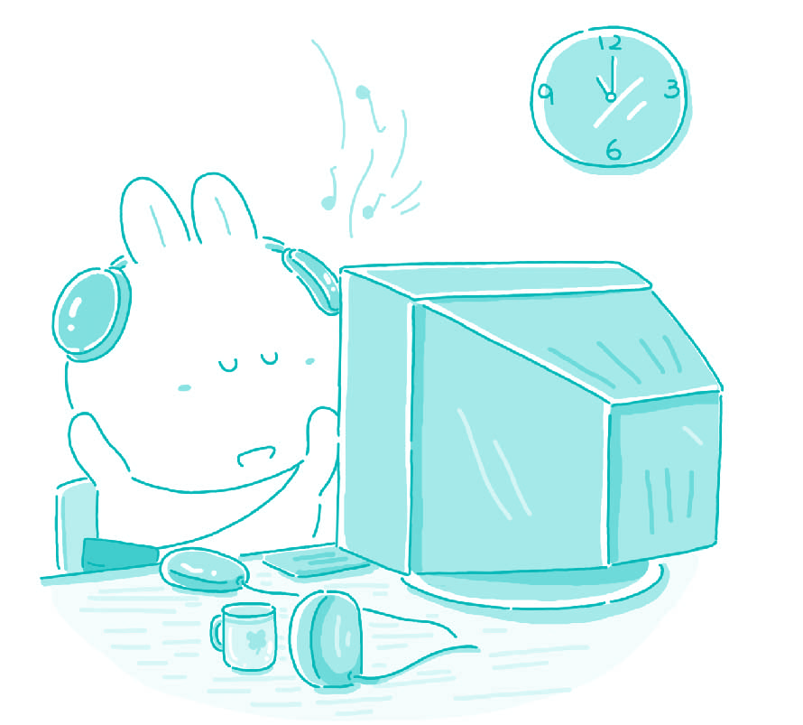

# 039. Technology, students' helper or not?

It is undeniable that continuously developing technologies have brought tremendous benefits, especially in learning area. Learning has in many ways become easier than has ever been before. Take learning English for example. In the past, few students owned tape recorders, and learning materials were scarce as well. But today, tape recorders get more and more inexpensive, and diversified learning materials are readily available. On the other hand, new devices, such as MP3 or MD players, are offered in market, and relevant learning materials\(MP3 files\) are easily and freely downloadable from the Internet.

However, it is a little bit haste to assert students can learn more information and learn it more quickly simply because technology helps, since technologies, as always, contribute both benefits and detriments. For example, computers, as have been mentioned, help students a lot in various ways, but at the same time have many negative even harmful impacts on the users. Most students nowadays play computer games, sitting before the table, staring at the screen, clicking mouse button, and the outcomes are cerebrum fatigue, visual deterioration and another day of waste. Chatting on the Internet is another great way to kill precious time, and one of negative side-effects of key-board dependence is that students nowadays can seldom spell correctly. Worst of all, investigations have shown that more than half of time that students have spent online was exhausted on browsing porn movies, pulp fictions or erotic photos and so on.

Students certainly want to learn more and to learn more quickly. But merely technology itself is not the solution. Learning itself is a skill and it only develops by practice. Computers and other devices can certainly help, but they won't make study any less painful, and technologies in fact provide no solution to overcome indolence that everyone has. Learning has never been easy, and will not be easier merely because of technologies. It always requires tremendous efforts and determination to learn something well. Too much advocacy on the fancy benefits of technologies will mislead much more than virtually help.

> ## 译文
>
> **39. 技术是学生的帮手吗？**
>
> 不可否认，不断发展的技术带来了巨大的好处，尤其是在学习领域。学习在很多方面变得比以前更容易。以学习英语为例。过去，很少有学生拥有卡带式录音机，而且学习材料也同样缺少。而今天，卡带式录音机越来越便宜，种类多样的学习材料随手可得。另一方面，市场上出现了一些新的器材，如MP3和MD机，而相应的学习材料（MP3文件） 很容易就可以从互联网上免费下载。
>
> 然而，宣称仅仅依靠技术的帮助就可以使学生学到更多信息和学得更快有点过于匆忙。因为技术像以往一样，不仅提供便利，也产生危害。例如电脑，像前面提到的一样，在很多方面对学生帮助不小，但是同时对使用者有一些负面甚至有害的影响。今天的大多数学生都玩电脑游戏，坐在桌前盯着屏幕并敲击着鼠标，结果就是大脑疲惫、视力减退又浪费了一天的时间。在互联网上聊天是另一种消耗宝贵时间的事情，另一种键盘依赖的负面影响是学生几乎无法正确拼写。最糟的是，调查显示学生们上网的一半多的时间消耗在看色情电影、淫秽书籍以及色情图片上。
>
> 学生们当然想学得更多并学得更快。但是单靠技术并不能解决问题。学习本身是一门技巧，并且只能靠练习来取得进步。计算机和其他器材当然有帮助，但是它们不会使学习变得更加好受，技术实际上并不能提供一种方法来克服每个人都有的懒惰。学习从来都不简单，也不会因技术变得更简单。要想学好某事总是需要巨大的努力和决心。过多地提倡技术带来的虚幻的好处将会误导而不是确实有所助益。

## Word List

* undeniable ［ˌʌndiˈnaiəbəl］ adj. 不可否认的
* fatigue ［fəˈti:g］ n. 疲乏，疲劳
* deprivation ［ˌdeprəˈveiʃən］ n. 剥夺
* diversified ［daiˈvə:səfaid］ adj. 多变化的，各种的
* browse ［brauz］ v. 浏览
* porn［pɔ:n］ n. \(=pornography\)色情文学，色情描写
* downloadable ［ˌdaunˈləudəbəl］ adj. 可下载的
* pulp ［pʌlp］ adj. 低级的
* detriment ［ˈdetrəmənt］ n. 损害，损害物
* erotic ［iˈra:tik］ adj. 性爱的，性欲的，色情的
* impact ［ˈimˌpækt］ n. 影响，效果
* click ［klik］ v. 发出滴答声，敲击
* solution ［səˈlu:ʃən］ n. 解答，解决办法
* cerebrum ［ˈserəbrəm］ n. 大脑

