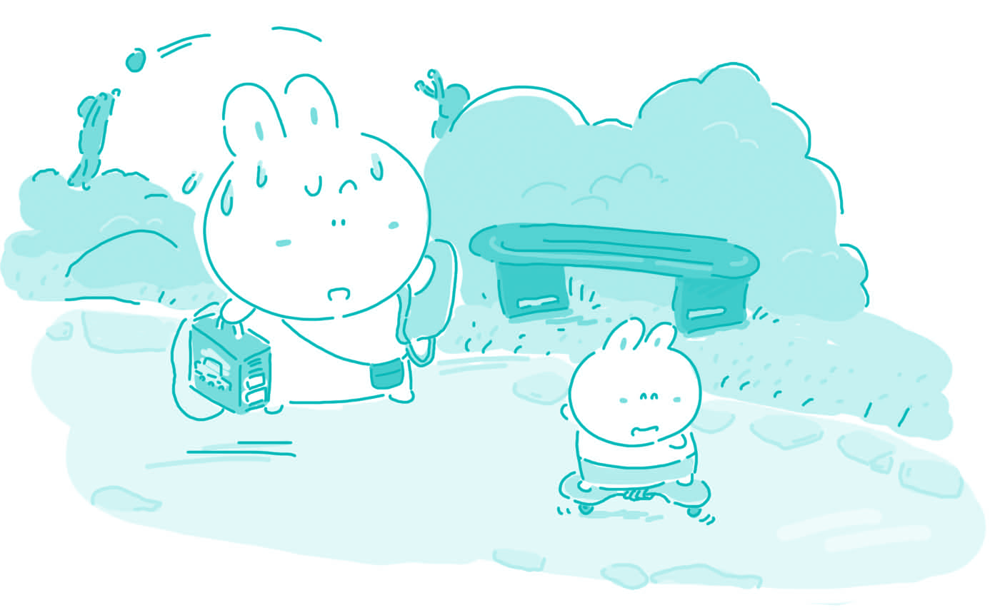

# 046. What makes a good son or daughter?

In traditional Chinese society, a person's most important relationship was that between a parent and a child. The only measure of whether a child was good or bad was whether or not they were obedient to their parents' wishes.

Traditionally a Chinese family had many children. Boys were expected to go to school and, after they grew up, to have a son of their own, and to manage the family's affairs. When his parents grew old, a son was expected to live with them and care for them. A girl's parents would usually arrange her marriage to someone who she did not love and without consulting her. After she was married, she was no longer a part of her biological family; instead she became an adopted daughter of her husband's family and had to respect her husband's parents as she would her own parents. She was also expected to bear her husband a son. A child who broke these norms, defied or disrespected their parents was seen as worthless or immoral at best, and could legally be killed by their parents in extreme cases.

Today of course, China is very different. Chinese children are still expected to respect their parents, but society is not as conservative as it used to be. When a Chinese son gets married, he will often prefer not to live in the same house with his parents, although he might still feel quite obligated to care for them in their old age. The greatest strides have been made by Chinese women, who now hope that their daughters grow up to marry someone that they love, and who is able to take good care of them.

The major revolution in the Chinese family since 1980s has been introduction of the one-child policy. Since Chinese families are now usually only allowed to have one child, the roles of parent and child have almost been reversed! Today's children in China, while still expected to treat their parents with respect, have become the "little emperors and empresses" of their families. Many "little emperors" are so doted on by their immediate and extended families that they become very spoiled, demanding toys, candy, and attention all day long. Because of the changing structure of the Chinese family, the bonds between parent and child, while still of primary importance, are characterized less by rules and respect and more by love.

> ## 译文
>
> **46. 好儿子或好女儿需具备哪些重要品质？**
>
> 中国传统社会中，一个人最重要的亲属关系是父母与子女之间的关系。衡量孩子好坏的惟一准则是他们是否遵从父母的意愿。
>
> 传统上一个中国家庭有多个子女。男孩们都被要求上学，长大后有自己的儿子并管理家庭事宜。父母变老时，儿子要住在身边照顾他们。女孩子的父母经常不与她商量就把她嫁给某个她并不爱的人。婚后，她就不再是生身父母家里的一份子；而是她丈夫家的养女，必须像对自己的父母那样尊敬公婆。她还被期望能给丈夫生个儿子。一个孩子若打破了这些规矩、反抗或不尊敬父母，往好里说他会被视为无用或道德败坏，一些极端的情况下可能被父母依法处死。
>
> 当然，如今的中国已大不一样。中国的孩子仍被要求尊敬父母，但是社会已不像过去那样保守。一个中国儿子结婚时，他往往喜欢不与父母同住，尽管他仍感到完全有义务在父母年纪大时照顾他们。中国妇女取得了最大的进步，如今她们希望自己的女儿长大后能与所爱的、有能力好好照顾她们的人结婚。
>
> 自上世纪80年代后中国家庭的一大革命是计划生育政策的实施。由于现在的中国家庭通常只允许要一个孩子，父母与孩子的角色几乎颠倒了。今天的中国子女虽然仍被要求尊敬父母，却已成为家里的“小皇帝”、“小皇后”。许多“小皇帝”受到直系和非直系亲属的过分溺爱，成天要玩具、糖果，要人照顾。因为中国家庭结构的变化，父母与子女之间的关系虽然仍是至关重要的，但其中的规矩敬重已少了，而爱更多了。

## Word List

* obedient ［əˈbi:diənt］ adj. 服从的；孝顺的
* obligated ［ˈa:bliˌgeit］ adj. 有责任的，有义务的
* adopted ［əˈda:ptid］ adj. 被收养的
* stride ［straid］ n. 改进，进步
* norm ［nɔ:m］ n. 标准，规范
* immediate family 直系亲属
* immoral ［iˈmɔrəl］ adj. 不道德的，邪恶的
* extended familylegally ［ˈli:gəli］ adv. 法律上，合法地（包括祖父母、外祖父母、姑姨等在内）大家庭
* defy ［diˈfai］ vt. 不服从，公然反抗，违抗的
* conservative ［kənˈsə:vətiv］ adj. 保守的，守旧的
* dote ［dəut］ vi. 昏聩；溺爱
* bond ［ba:nd］ n. 关系，纽带

