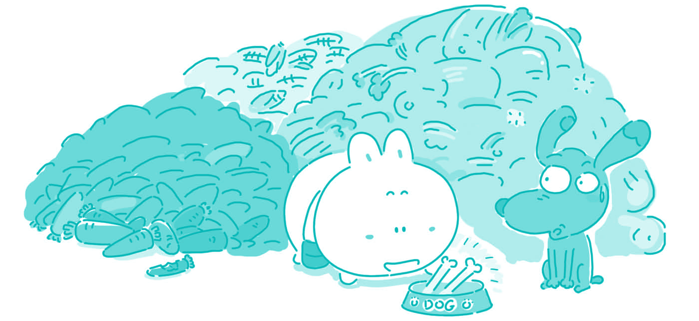

# 050. Do what you already do well or try new things?

A defining characteristic of people is the degree to which they are willing to break out of their comfort zone. Old habits and well honed skills give great comfort to any individual, but new personal challenges build character and allow one to grow as a person. It was not until very recently that I fully comprehended this. Today, while I still enjoy doing the things I am already good at, I have become increasingly eager to try new things because I have learned the value of new experiences.

I have always been a talented athlete, and I still find great comfort on the basketball court and in the swimming pool. These are familiar places where I feel at home. They are also places where I continue to excel. However, not so long ago my older cousin, a person whom I have always looked up to and admired, reminded me that there is nothing wrong with discovering new talents or doing many different things very well. He introduced me to music.

For the past sixteen months I have been learning how to play the guitar, and this new experience has been extremely rewarding. Initially, I struggled. My inability to play even the simplest of notes frustrated me, and quite often I thought about giving up. Yet with my teacher's encouragement I continued to make progress. Now my appreciation for music is much more profound than ever before, and my appetite for new experiences is whetted.

Together with a couple of classmates I have formed a book club. Every week we get together and discuss a piece of literature. Of course, my friends were hesitant to give this new idea a try at first. Nevertheless, I have convinced them to be risk takers, and now all of us enjoy not only each others' company but also books and stories, which is a completely new experience for all of us. Together we are planning to learn how to dance and to purchase bicycles to explore the area around our hometown. We don't want to limit ourselves to what we know already.

> ## 译文
>
> **50. 轻车熟路还是勇于创新？**
>
> 人的很重要的一个特征就是在多大程度上愿意打破他们的舒适区域。老习惯与高超的技能会让人十分舒适自在，但是新的对个人的挑战能够铸造性格，使人成长。我是直到最近才完全理解这一点的。今天，当我仍然乐于做那些已经十分擅长的事情时，我却变得越来越急于尝试新的事物，因为我已懂得新体验所带来的价值。
>
> 我一直是一名运动天才，在篮球场上和游泳池里仍能找到极大的舒适感。在这些熟悉的地方里我习惯自如，并且继续出色。然而，不久以前一位我一直尊敬的表哥提醒了我，发掘新的能力或者做好不同的事情是没什么不对的。他让我试试音乐。
>
> 在过去的16个月中，我一直学习弹吉他，这种新体验非常有益。起初我有过挣扎。连最简单的音调都弹不好让我十分沮丧，很多次我都想过放弃。然而在老师的鼓励下，我继续进步。现在我对音乐的欣赏水平要比从前高深得多，对新体验的兴趣也被激起来了。
>
> 我和几个同学一起组成了一个读书俱乐部。每周我们聚在一起讨论一篇文学作品。当然，我的朋友一开始曾经犹豫是否尝试这个新想法。不过我说服了他们成为敢于冒险的人，现在我们不仅非常高兴相伴在一起，也享受着书与故事带来的乐趣。我们正在一起计划着去学跳舞，还要买自行车在家乡的周围地区进行探险。我们不愿将自己局限在已知的领域中。

## Word List

* zone ［zəun］ n. 地域，地带，地区；环带；圈
* hone ［həun］ vt. 磨练
* talented ［ˈtæləntid］ adj. 有才能的
* rewarding ［riˈwɔ:diŋ］ adj. 有益的，值得的
* initially ［iˈniʃəli］ adv. 最初，开头
* profound ［prəˈfaund］ adj. 深刻的，意义深远的
* hesitant ［ˈhezitənt］ adj. 犹豫的，吞吞吐吐的
* explore ［ikˈsplɔ:］ v. 探险，探测，探究
* company ［ˈkʌmpəni］ n. 同伴

