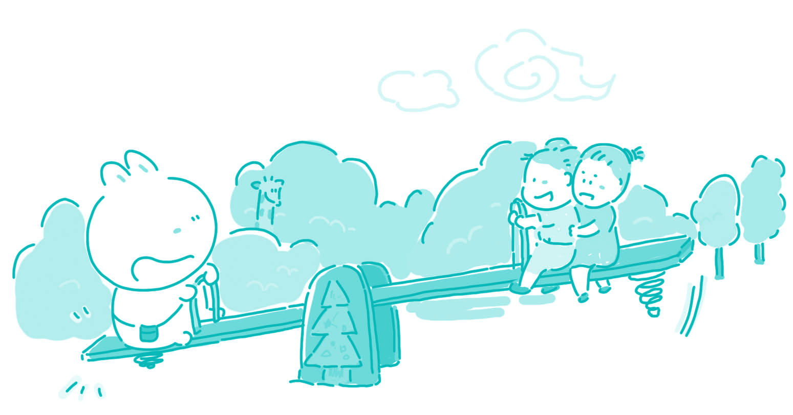

# 060. Are games equally important for adults and children?

Games are fun. This is true for adults and children alike. However, games also teach a variety of skills and they further every domain of a person'development. This is particularly important during the early stages of life.

Through games children learn gross motor and fine motor skills, they practice and develop the ability to use language, and they learn important interpersonal and social skills. Adults can use games to strengthen these areas, but their abilities are already much more advanced, and therefore games are more important for children.

In play a child learns gross motor skills such as walking or jumping, which an adult has already mastered. Pushing a shopping cart, for example, teaches a toddler to balance his/her weight and to use his/her legs to support his/ her body. This activity is game and exercise at the same time, but it would be completely unnecessary for adults. Similarly, fine motor skills and hand-eye coordination are areas in which a child has much more to learn than an adult.

Thus playing catch with a baseball has a much greater benefit to the young and inexperienced person.

Language games allow children to practice and strengthen their language skills. Even simple singsong or rhyming games aid in this development. Needless to say, due to their advanced language ability, adults would not get much out of these simple ditties. In comparison, adult language games such as scrabble don't build but fine-tune vocabulary ability. Children are not able to compete here because they have not yet amassed enough knowledge.

Elementary interpersonal and social skills ranging from communication to cooperation are also developed in play. Children learn systems of social rules when engaging in simple activities like pick-up football games. For example, they learn how to control themselves and to tolerate their frustrations around others. They also learn how to work in a team. These, of course, are abilities that are extremely important for adults as well, but, once again, children have more to learn.

> ## 译文
>
> **60. 游戏对于成年人和孩童同样重要吗？**
>
> 无论是对孩子来说还是对大人来说，游戏都很好玩。但是，游戏还可以教给你很多技巧，并能推进你自身发展的方方面面。在年轻的时候这尤其重要。通过游戏孩子学习到或简单或精细的动手能力，他们练习和发展了运用语言的能力，同时也学会了重要的人际交往和社交技巧。成年人可以通过游戏来加强这方面的能力，但是他们的能力已经很强了，所以游戏对孩子更重要。
>
> 在游戏中，孩子们学到了基本运动的技巧，如行走、跳跃等，而这些是成年人已经掌握的了。例如，向前推购物车，教正在学步的孩子学会平衡自己的身体、学会用自己的腿来支撑整个身体。这种活动既是游戏也是锻炼，但是对于成年人来说就完全没必要了。同样，良好的动手能力和手眼协调能力也是孩子需要学习的领域。所以练习抓住垒球对年轻的而没有经验的人来说更有益处。
>
> 语言游戏使孩子可以练习和巩固自己的语言技能，即使是最简单的歌唱和韵律游戏都能帮助他们发展语言技能。不用说，由于成年人已经具有良好的语言能力，所以他们不可能从简单的游戏中获得什么。但恰恰相反，适合成年人玩的文字游戏，如拼字游戏，不是帮助他们建立语言能力，而是帮助他们调整其词汇能力。在这方面孩子是无法和成年人竞争的，因为他们还没有获得足够的知识。

## Word List

* variety ［vəˈraiəti］ n. 变化；多样性
* ditty ［ˈditi］ n. 小调，小曲
* domain［dəu ˈmein］ n.领土，领域；范围
* scrabble ［ˈskræbəl］ v. 乱写，乱涂
* particularly ［pəˈtikjələli］ adv. 独特地；显著地
* amass ［əˈmæs］ v. 收集；积聚
* elementary ［ˌeləˈmentəri］ adj. 初步的；基本的
* motor skill 动手能力
* toddler ［ˈta:dlə］ n. 初学走路的孩子
* tolerate ［ˈta:ləˌreit］ v. 忍受，容忍
* coordination ［kəuˌɔ:dˈneiʃən］ n. 同等；调和
* frustration ［frʌˈstreiʃən］n. 挫败，挫折，受挫
* rhyme ［raim］ n. / v. 韵；押韵

