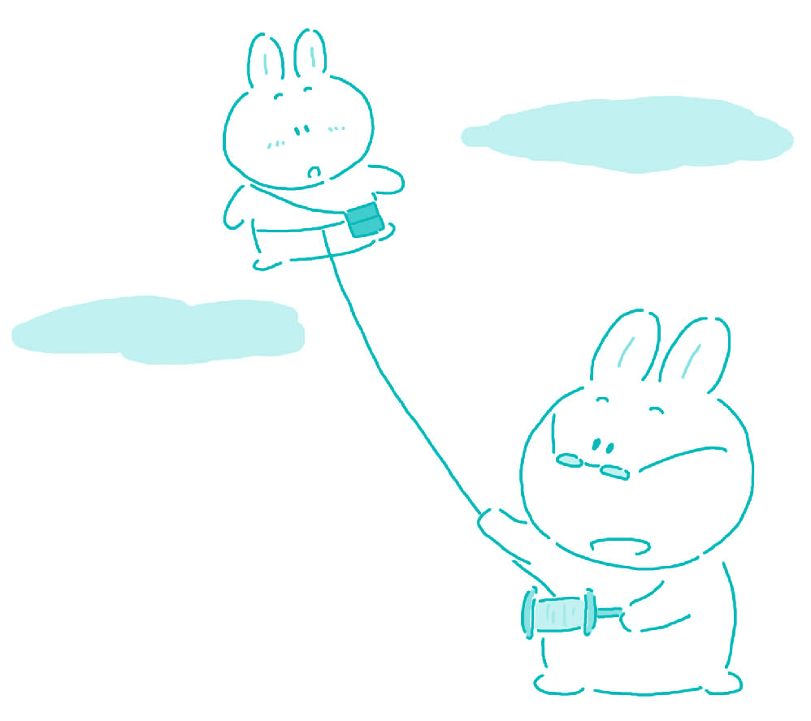

# 061. Should adults make important decisions for their older teenage children?

Parents or other adult relatives should not make decisions on behalf of their older teenage child. Nevertheless, they must take an active part in the decision

making process of their offspring. They can use their knowledge and experience to prevent their teenager from making costly mistakes while allowing him/her to gain confidence and learn from his/her smaller errors so that he/she will be able to make mature decisions of his own in the future.

Teenage children often lack the experience and knowledge to make sound decisions, and here their parents' input is valuable and necessary. Finding the right university or the right job after graduating from senior school is an example for this. A teenager has not worked before and never attended a university, and thus his knowledge in both areas is extremely limited. Here the parents should advise their child and ensure that he/she makes the right decision.

In order to be able to make sound decision in the future a young adult must gain confidence, and parents can help by engaging him/her in dialogue and providing him/her with all the necessary information. A child between the ages of 15 and 18 will be able to recognize the best arguments and reasons. Through the parents' guidance he/she will arrive at the correct decision and feel as though it was completely his/her own. Not only will he/she continue to seek the reliable advice of his/her parents, but the self-confidence gained from this experience will make it easier for him/her to make decisions in the future.

While parents should guide or direct their child, sometimes it is helpful to allow him/her to make a mistake. This will teach the child to live with the consequences of a wrong decision and also to ponder future choices more carefully. For example, a child might ignore his/her parents' advice and pick a summer job that sounds very interesting initially, but which he/she comes to loathe almost immediately. This experience will be invaluable when the child grows up and has to find a real job.

> ## 译文
>
> **61. 成人是否应该为接近成年的孩子做重要的决定？**
>
> 家长和成年亲属不应为年龄大的孩子做任何决定。但是，在孩子做决定的过程中，他们必须积极参与，给出建议。他们可以用自己的知识和经验阻止孩子做出将付出代价的错误决定，但是也不能打击孩子的自信心，应该允许孩子从小错误中学习，以培养他将来做出成熟决定的能力。
>
> 十几岁的孩子往往缺乏经验和知识，不能很好地做出决定。这时父母的建议就非常可贵和必需了。高中毕业后寻找一个合适的大学或工作就是这样的例子。十几岁的孩子以前没有工作过，也没有上过大学，所以在这两方面他的知识都非常匮乏。这时父母应该给出建议，保证孩子做出正确的选择。
>
> 如果想在将来能做出正确的决定，年轻人必须充满自信。父母可以通过和他谈话、提供必需的信息来建立他的自信心。15至18岁的孩子已经能够辨认出什么论据和论点更有说服力。通过父母的引导他可以做出正确的决定，并且还会觉得这个决定完全是自己做出的。这样他不仅会继续寻求父母的帮助，让他们给出可靠的建议，还能从做出决定的过程中获得自信，以后再做决定就不是件困难的事情了。
>
> 父母在引导孩子的时候，允许他们偶尔犯错误也是很有益处的。因为这会使孩子知道错误决定带来的后果，在以后做出决定时更加谨慎。例如，孩子可能不听父母的建议，找了个听起来很好听的假期工作。但是他很快就厌倦了这个工作。当孩子成年后真正找工作时这种经历就显得非常有意义了。

## Word List

* on behalf of 代表…
* teenage ［ˈti:nˌedʒ］ adj. 十几岁的
* offspring ［ˈɔ:fˌspriŋ］ n.（单复同）儿女，后代
* confidence ［ˈka:nfidəns］ n. 信心；信赖
* senior ［ˈsi:njə］ adj. 年长的；高级的
* recognize ［ˈrekəgˌnaiz］ v. 认可，承认；认出
* self-confidence ［ˌselfˈka:nfidəns］ n. 自信
* ponder ［ˈpa:ndə］ v. 沉思，考虑
* initially ［iˈniʃəli］ adv. 最初地，开头地
* loathe ［ləuð］ v. 厌恶，憎恶

