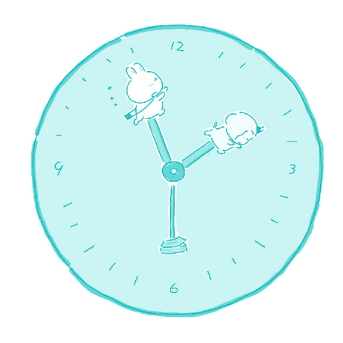

# 071. Choosing a job: high-paying with long working hours, or low-paying with short working hours?

I am optimistic that through my studies and continued hard work I will be able to find a job that will provide my future family and me with financial security. We should be able to afford the necessities of life, such as a modest home, enough food to nourish us and keep us in good health, as well as education for our children. Hopefully, I will find myself in the fortunate situation where I can decide between a high-paying job with long hours and a lowerpaying job with shorter hours. I would choose the job with the lower salary and greater personal time without hesitation, because my family and friends are the most important things in my life.

Time is the greatest investment I can make into the relationships with my wife and my children. A marriage is not just a decision one makes but a promise that one keeps. In order to do so one has to be there for the other person and share moments of joy as well as times of difficulty. Nowadays, too many relationships wither away as the partners are unable to work out their problems or bond through meaningful experiences. Personal careers become too important and family time becomes a rare occurrence.

The absence of one parent, due to professional career or divorce, can have a very negative effect on a child's development. The child might question his value to father or mother \(depending on which one is continually absent\) and develop low self-esteem. Without the presence of either or, worse, both parents, the child will be more likely to make bad decisions as he is lacking proper guidance. And there is one point should also be mentioned, i.e. neither expensive toys nor fancy clothes can compensate for this.

Lastly, I can derive more pleasure from spending time with my friends than I ever could from driving a sports car or taking luxury vacations. The inner peace and balance that I enjoy from their company are invaluable to me. Also, a million dollars in the bank would be worth nothing if I didn't have the time to enjoy these riches with my friends.

> ## 译文
>
> **71.选择何种工作：高薪但工作时间长，还是低薪但工作时间短？**
>
> 我乐观地相信，通过我的学业和一直努力的工作，我将能够找到一个可以为我将来的家庭和我自己提供经济保障的工作。我应该可以负担自己生活的必需品，诸如一所一般的房子，可以养活我们并能够使我们保持身体健康的足够的食物，还能为我们的孩子提供教育等等。我希望我能够非常幸运，可以在高薪而工作时间长的工作和低薪而工作时间短的工作之间做选择。那时，我将会毫不犹豫地选择那份虽然薪水少些但是拥有更多的、可以自由支配时间的工作，因为我的家庭和朋友们在我生命里是最为重要的。
>
> 时间是我能够为自己的妻子、孩子间的关系投入的最大投资。一场婚姻并不仅仅只是一个需要做出的决定，而是一个需要我们遵守的诺言。为了能够做到这一点，一个人必须要为了另一个人守在那里，并且共同分享快乐、分担困苦。现在，太多的关系随着伴侣不能有效地解决他们遇到的困难或束缚而渐渐淡化。工作变得过于重要，而留给家庭的时间变得非常稀少。
>
> 因为职业或离婚而失去双亲中的一方，这将会对孩子的发展产生负面的影响。孩子可能会对自己对于父亲或母亲（父亲还是母亲取决于哪一方的离去）的价值产生疑问，因此将会有自尊不足的倾向。没有父母中的一方，或者更糟的，父母双方都失去了，孩子将会更有可能做出错误的决定，这是因为他缺少正确的指导。并且，还有一点需要指出的是，即使是昂贵的玩具和华丽的服饰也不能弥补这一点。

## Word List

* optimistic ［ˌa:ptəˈmistik］ adj. 乐观的；有信心的
* whither away 消失，不知去了哪里
* have effect on 对…有影响
* modest ［ˈma:dist］ adj. 谦虚的；适度的
* self-esteem ［ˌselfiˈsti:m］ n.自尊，自尊心
* nourish ［ˈnə:riʃ］ v. 滋养，使健壮
* fancy ［ˈfænsi］ adj. 奇特的；华丽装饰的
* hesitation ［ˌheziˈteiʃən］ n. 犹豫，踌躇
* compensate ［ˈka:mpənˌseit］ v. 偿还，补偿
* occurrence ［əˈkə:rəns］ n. 事件，发生的事情
* derive from 得自，由来，衍生
* absence［ ˈæbsəns］ n.不在，缺席，缺乏
* luxury ［ˈlʌgʒəri］ adj. 奢侈，华贵，豪华
* divorce ［diˈvɔ:s］ n. 离婚；脱离&lt;/li&gt;

