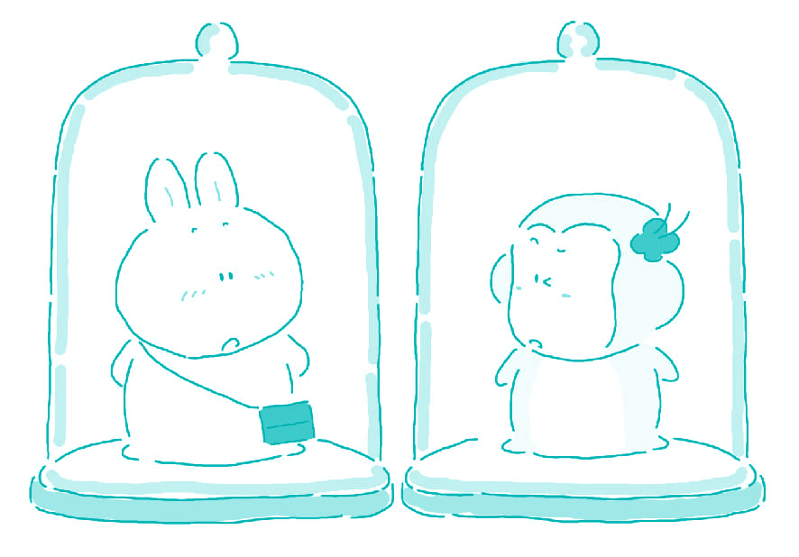

# 077. Should boys and girls attend separate schools?

In my country, China, many people in a sense live in a ridiculous culture where young boys and girls should never say"love" to each other. Moreover, it is absolutely a shame that such affairs happen in campus. To avoid alleged shame or danger of it, some people assert that boys and girls should attend separate schools.

The point is, is there anything wrong when a little boy says"I love you" to a little girl? Gone are the days when"love" was a forbidden word in our culture, it has now, nevertheless, actually quite different connotations from that of the word in western society. It can be seen that people in Hollywood movies often say "I love you" to almost everyone naturally, readily and easily, including friends, family members, partners in work, even an unknown taxi driver! But in China, not surprisingly, many people have never said"I love you" to their parents, even seldom to their mates or children."Love", in Chinese word, does in fact carry subtle connotations related to immoral affairs. It seems not a problem of is there anything wrong, but one of there must be something wrong if a teenager dares to say anything about "love!"

Even if there must be something wrong when a teenager falls into love, is it something so appalling even evil that adults have to take action to prevent or even fight? Did we ever discover any prudent evidence which clearly prove it is really something bad? Hardly. It is in fact quite natural that a little boy admire a beautiful girl or a little girl feels a smart boy appealing. And such emotions do not harm anything. Alleged"puppy love" simply is a nonsense concept invented by ignorance. Girls and boys actually do not even know what love is! Perhaps they merely imitate behaviors of adults around them. What we adults should do is not to make them believe"love" is evil, but to teach them what true love really means. Regrettably, those adults never realize that they actually fail to assume their responsibility, but presumptuously believe they are capable of eliminating love among boys and girls by separating them into different school. It will never work.

Separate school once was one of evil signs of discrimination of women, but today reemerges to prevent"love affairs" among teenagers—a high school in Beijing recently announced that it has already separated girls from boys into different classes. I can hardly imagine any benefit that such a scheme could produce except for further distortions of teenagers' natures.

> ## 译文
>
> **77. 男生与女生是否应该分校上学？**
>
> 在中国，很多人生活在一个古怪的文化中——男孩和女孩之间永远不能说“爱”字。并且，如果此类事情发生在校园中，将被认为是可耻的。为了避免所谓的羞耻和危险，有些人声称男孩和女孩应该分开读书。
>
> 问题是，一个小男孩对一个小女孩说“我爱你”有什么错呢？“爱”作为一个被禁止的词汇的时代早就过去了，可是这个词即便在今天也确实与西方的同一个词有着相当不同的意味。我们可以看到在好莱坞电影里人们很自然、轻松地对他人说“我爱你”，包括对朋友、家人、同事，甚至对一个陌生的计程车司机！但是在中国，毫不奇怪，大多数人从来都不曾对同事说“我爱你”，甚至对爱人或孩子都不曾说过。在某种程度上“爱”在中文中实际有些与不道德相关的意味。看起来这并不是有没有错的问题，而是如果一个孩子居然敢说“爱”那就一定有错。
>
> 就算是小孩子爱上什么人真的有问题，难道就那么骇人甚至罪恶，乃至成年人必须采取行动去制止吗？我们有什么证据表明这样的事情确实是坏的吗？没有吧。一个小男生喜欢一个漂亮小女生，或者一个小女生被一个帅气小男生吸引是非常自然的，这样的情感没有任何害处。所谓的“早恋”只不过是一个无知导致的没意义概念。男孩女孩实际上并不知道“爱”是什么！也许他们只不过是在模仿身边成年人的行为而已。我们成年人应该做的并不是让他们相信“爱”是罪恶的，而应该教他们真爱意味着什么。遗憾的是，那些成年人从来都没有意识到他们实际上并没有承担他们的责任，而是自以为是地通过让男孩和女孩在不同的学校读书以消除男孩女孩之间的爱。这是永远不会成功的。
>
> 男女分校曾经是歧视女性的罪恶标志之一，但今天却因为要阻止早恋而重新出现——北京的一所高中最近宣布男生女生将在不同的班级上课。我很难想象这样的一个计划除了进一步扭曲青少年的天性之外会有什么样的好处。

## Word List

* ridiculous［ri ˈdikjələs］ adj.荒谬的，可笑的
* take action to 对…采取行动
* affair ［əˈfεə］ n. 事务；私事，恋爱事件
* prudent ［ˈpru:dnt］ adj. 慎重的；谨慎的
* alleged ［əˈledʒd］ adj. 所谓的
* admire ［ədˈmaiə］ v. 赞美，钦佩，羡慕
* assert ［əˈsə:t］ v. 断言，声称
* puppy love 早恋
* attend ［əˈtend］ v. 出席；注意
* nonsense ［ˈna:nˌsəns］ n. 胡说，废话
* forbidden ［fəˈbidn］ adj. 禁止的，严禁的
* presumptuously ［priˈzʌmptʃuəsli］ adv. 自以为是地
* connotation［ˌka:nəˈteiʃən］n.（词的），内涵
* mate ［meit］ n. 配偶
* eliminate ［iˈliməˌneit］ v. 排除，消除
* subtle ［ˈsʌtl］ adj. 微妙的
* regrettably［riˈgretəbli］ adv. 遗憾地，可悲地
* appalling ［əˈpɔ:liŋ］ adj. 惊人的，骇人的
* reemerge ［ˈri:iˈmə:dʒ］ v. 再度出现
* evil ［ˈi:vəl］ adj. 邪恶的，有害的
* distortion ［diˈstɔ:ʃən］ n. 扭曲，变形

