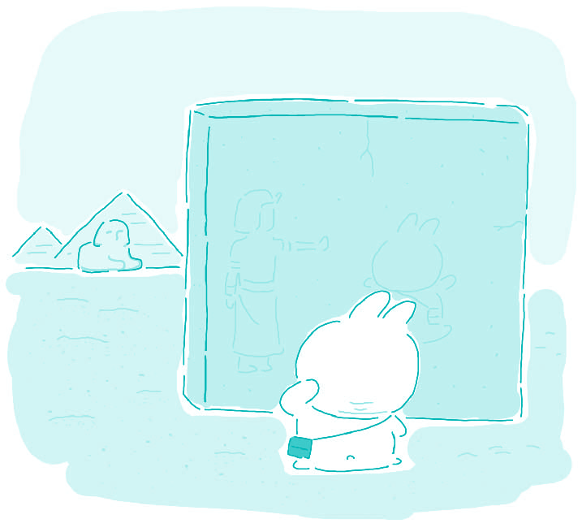

# 086. When and where in the past do you want to go?

If I could go back to a certain time and place in the past, I would choose to go to ancient Egypt, to the time when they were building the great pyramids. This time period and place is greatly interesting to me for the following reasons: first, how were the great pyramids built? Second, Egypt is one of the few places in the world that has as rich a culture as China's. How did ancient life in Egypt compare to the existence of the ancient Chinese person? Finally, I find this time and place interesting because I am curious about the myths and legends that ancient Egyptians believed in.

There is much speculation as to exactly how the great pyramids were built. The pyramids are an architectural feat, even by today's standards. They are massive in size, with almost perfect angles leading up to the point at the top of the pyramid. How did the men manage to carry those enormous stones up the side of the pyramid? How was it possible to cut the stones so precisely, to allow for this even, mathematical design? Current science has analyzed these problems, and has decided that with today's technology, this would not be a problem. I am very interested, however, to learn how such technology was possible in ancient Egypt.

I am also very interested in how ancient Egyptian life compared to that of the ancient Chinese. Did they experience similar toils, or were their lives very different? Did the ancient Egyptians know about the ancient Chinese? All of these questions would be answered for me if I could travel back to the abovementioned time period.

China has some very interesting myths, legends and religions that were formed thousands of years ago. Ancient Egyptians were spiritual people also. I am curious to know more about these ancient religions. Were the beliefs held by the majority, or were there only a few who believed in such ideas?

There are so many unanswered questions about ancient periods, particularly ancient Egypt. By traveling back in time, I would learn a great amount about topics that have remained unanswered for thousands of years.

> ## 译文
>
> **86. 你想去从前的何时何地？**
>
> 如果可以回到从前的某个时间的某个地点，我会选择去古埃及，回到他们建造伟大金字塔的时期。这个时间和地点对我来说特别有吸引力，原因如下：首先，这些金字塔是怎样建造的？其次，埃及是很少几个和中国一样具有悠久历史的国家之一，和古代中国人相比，古埃及人的生活是怎样的？最后，我认为这个时间和地点有趣是因为我对埃及人信仰的神话传说感兴趣。
>
> 对于金字塔到底是怎么建造的这个问题有着诸多的猜测。即使以现代人的标准来说，金字塔也是建筑上的一个壮举。这些金字塔如此巨大，却直到顶端都有那么完美的棱角。当时的人们是如何设法运送这些巨大的石块到金字塔旁的？怎么可能如此恰好地将这些石块切割成形来完成平滑精确的设计？当今的科学已经分析了这些问题，利用今天的技术达到这些也不是问题。然而，我非常感兴趣的是这些技术在古埃及是怎么成为可能的。
>
> 我对古埃及人的生活同当时中国人生活的比较也很感兴趣。他们是生活的相似、还是大相径庭？古埃及人是否了解古代中国人？如果我可以回到上面提到的时间阶段，所有的问题都会得到答案。
>
> 中国有着许多非常有趣的神话、传说和信仰，它们都形成于几千年前。古埃及人同样是有宗教信仰的。我想了解关于这些古代信仰更多的事情。这些信仰是被大多数人接受，还是只是很少人信奉这些思想？
>
> 关于古代，尤其是关于古代埃及，有着许许多多的还没有得到解答的问题。通过穿梭时空回到过去，我将可以了解更多的关于那些几千年来尚未解答的问题。

## Word List

* ancient ［ˈeinʃənt］ adj. 远古的，古老的
* angle ［ˈæŋgəl］ n. 角；角落
* pyramid ［ˈpirəmid］ n. 金字塔
* precise ［priˈsais］ adj. 精确的，准确的
* myth ［miθ］ n. 神话
* toil ［tɔil］ n. 辛苦；苦工
* legend ［ˈledʒənd］ n. 传说
* above-mentioned ［əˌbʌvˈmenʃənd］ adj. 上述的
* speculation ［ˌspekjəˈleiʃən］ n. 思索
* feat ［fi:t］ n. 技艺；功绩
* spiritual ［ˈspiritʃuəl］ adj. 精神的；灵魂的
* massive ［ˈmæsiv］ adj. 厚重的，大块的

