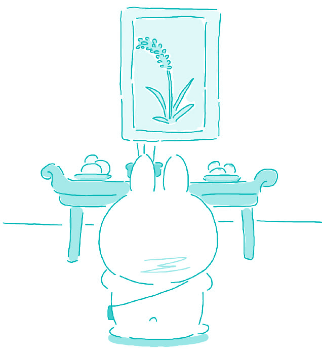

# 098. The thing representing your country

If I were to send one thing to an international exhibition that represented my culture, it would be rice. Chinese culture, boasting a lengthy history, is composed of numerous sub-cultures. The agricultural way of life, centered around rice, has played a vastly important part in the country's history.

For thousands of years, the Chinese have been diligently cultivating their land. Blood, sweat and tears have been shed over their soil in the pursuit of favorable harvests. This reliance on the land for so many thousands of years accounts for China's strong rural essence. The need for rice production has led the Chinese to pay particular attention to irrigation technologies and improving cultivation. The agricultural way of life, centered on rice, has had a strong influence on the social, economic, political and ideological developments of ancient China. In this sense, traditional Chinese culture may be considered a"rice culture."

"A meal without rice," the Chinese say,"is like a beautiful woman with only one eye." In China, where the word for rice is also the word for food, young girls are warned that every grain of rice they leave in their bowls will be a pockmark on the face of their future husbands. Instead of saying,"How are you?" as a typical greeting, the Chinese ask"Have you had your rice today?" Quitting or losing a job is called "breaking the rice bowl" and it is bad luck to upset a bowl of rice.

Rice is also a very important commodity in today's society. It is one of the major exports in China, allowing people all over the world to take part in something that emanates Chinese culture. Rice remains a staple food for both the rich and the poor, and there is hardly a meal had in our country that does not involve this fine grain. As you can see from the above-mentioned text, rice is an integral part of Chinese culture and tradition. While Chinese culture is spread over a vast number of arts and crafts, I believe that it is the humble, but profound rice that speaks to us all, and most poignantly represents the essence of our culture.

> ## 译文
>
> **98. 代表你国家的一样东西**
>
> 如果让我送一样代表中国文化的东西去参加国际展览，那就是稻米。中国文化，源远流长，包含着大量的文化分支。围绕稻米而展开的农业生活在中国历史上扮演着非常重要的角色。
>
> 几千年来，中国人民一直在勤勤恳恳地耕耘着他们的土地。血水、汗水、泪水，伴着对好收成的追求一起挥洒到了他们的土壤里。这种几千年来对土地的依赖诠释了中国作为农业大国的本质。对稻米产量的需求使中国人特别关注灌溉技术，改善耕作。以稻米为中心的农业生活对古代中国的社会、经济、政治和意识形态发展产生了极大的影响。从这个意义上来说，传统的中国文化可以被视为“稻米文化”。
>
> 俗话说，“吃饭没有米，就像漂亮姑娘只有一只眼”。在中国，与米有关的词也都与食物有关。小女孩们会被告诫饭碗里每剩下一粒米，未来丈夫脸上就会多一颗麻子。中国人典型的问候语是“你今天吃了吗？”而不是“你好吗？”。中国人把辞职或失业称为“打破饭碗了”，而打翻了一碗米会被认为是要倒霉的先兆。
>
> 稻米在当今社会也是一种重要的商品。作为中国的主要出口商品之一，稻米使世界各国人民体味到了中国文化的博大精深。稻米一直是人们的主食，没有贫富之分。在我们国家，没有一顿饭不与稻米这种细粮有关。
>
> 综上所述，稻米是中国文化和传统不可分割的一部分。虽然中国文化遍布于大量的艺术品和手工艺品中，我仍然坚信，是这谦卑而又有深邃内涵的稻米在向我们传达，它才最能代表我们的文化。

## Word List

* boast ［bəust］ v. 自夸；以拥有…而自豪
* be composed of 由…组成
* sub-culture ［ˈsʌbˌkʌltʃə］ n. 亚文化，次文化
* agricultural ［ˌægriˈkʌltʃərəl］ adj. 农业的，农艺的
* cultivate ［ˈkʌltəveit］ v. 培养，耕作
* shed ［ʃed］ v. 流下；流出，发散
* irrigation ［ˌiriˈgeiʃən］ n. 灌溉；冲洗
* ideological ［ˌaidiəˈla:dʒikəl］ adj. 意识形态的；思想的
* pockmark ［ˈpa:kma:k］ n. 痘痕，麻子
* take part in 参与，参加
* emanate ［ˈeməˌneit］ v. 散发，发出；发源
* poignantly ［ˈpɔinjəntli］ adv. （味觉、嗅觉方面）刺激地 

