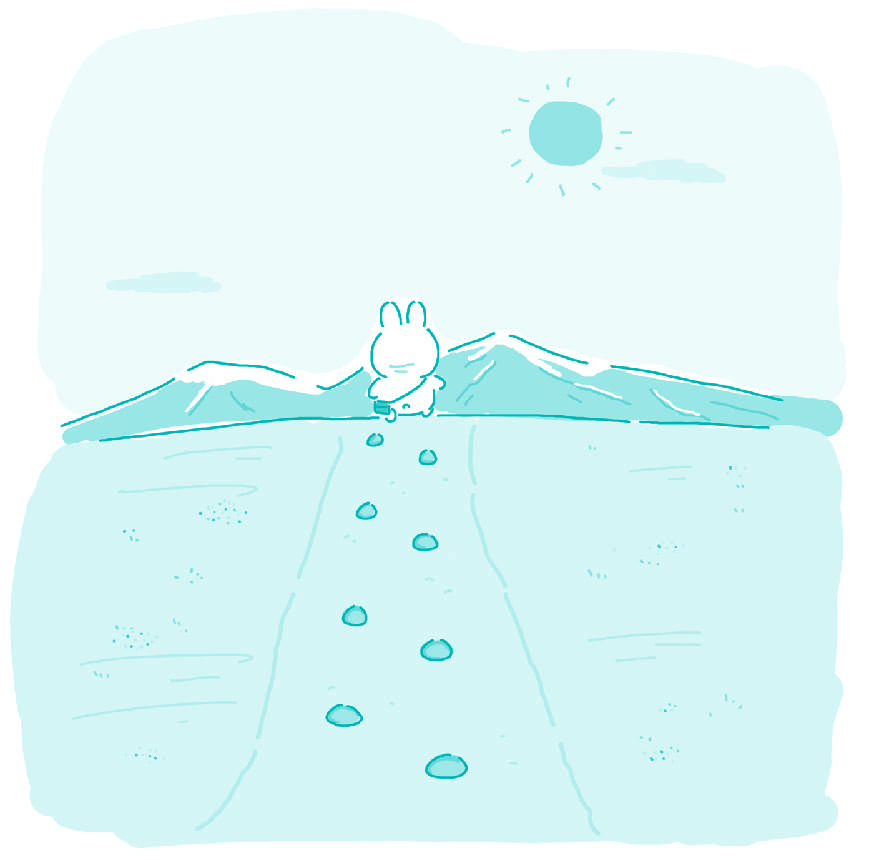

# 108. Learning about life: by listening to the advice of others or through personal experience?

Some people believe that the best way to learn about life is to listen to the advice of friends and family. Others argue that the most beneficial way to learn about life is through personal experience. I want to maintain that learning about life through personal experience is the best way. I believe this because one usually does not learn well unless he/she experiences something on his/her own, because one can have different opinions and views on life than his/her family and friends, and because it is simply a more interesting way to learn.

There have been many times in my life where a family member told me that life was a certain way, but I still wanted to see for myself. After having the experience, I agreed with what my family member had told me. However, I never regretted trying the experience for myself. I think one can learn something more completely if he/she experiences it for himself/herself.

When a family member or a friend tells me to do something, I value his/her opinion. However, there are some occasions when I do not fully agree with their opinions. In these cases, I want to try out the experience. There is a possibility that I will disagree with their conclusions on the topic. For example, if a friend tells me that a movie is terrible, I might still go to see the movie. It is more than possible that we will have differing opinions on whether the movie was good or not.

Finally, I think it is important to learn about life through personal experience because it is a much more interesting way to learn. If one never experienced anything for oneself, life would be very boring. For example, a friend told me that Urumchi was a city that I would not enjoy visiting. He said there were not many attractions there, and there were many other beautiful places in China that I should go instead. In spite of this warning, I went to see Urumchi for myself. I did not think the city was spectacular, but I did have a good time on my trip, and was glad that I went. Having the experience of going to the place was worthwhile enough for me.

> ## 译文
>
> **108. 了解生活：听取他人的建议还是亲身经历？**
>
> 有些人认为了解生活最好的方法是听取家人和朋友们的建议，有些人觉得通过个人经历来了解生活是最有效的办法。我赞同后者，因为人只有通过自己的亲身经历才能有更好的认识；因为一个人在一些生活问题上可能跟家人和朋友们有不一样的看法和观点；因为这是一种更有意思的了解生活的方式。
>
> 有很多次，我的家人告诉我生活是一条怎样的道路，但我依然想亲自看一看。经过了亲身体验，我同意了家里人的看法。然而，我从不后悔亲自经历的那些体验。我认为一个人有了亲身体验后会学得更深刻。
>
> 当家人或朋友告诉我应该做什么事情时，我会考虑他们的看法。然而，有些时候我不完全同意他们的观点。在这种情况下，我就想去亲自体验一下。很可能我将不同意他们关于某个问题的结论。例如，如果一个朋友告诉我某部电影非常糟糕，我仍旧会亲自去看一看。极有可能的结果是，这部电影究竟是好是坏，我们的观点不尽相同。

## Word List

* spectacular ［spekˈtækjulə］ adj. 壮观的
* terrible ［ˈterəbl］ adj. 很糟的，极坏的
* Urumchi n. 乌鲁木齐
* attraction ［əˈtrækʃən］ n. 吸引（力），吸引人的事物

