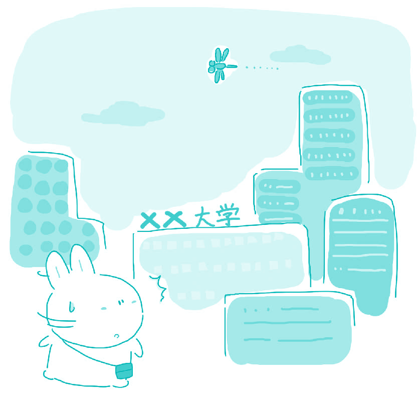

# 113. Compare the advantages and disadvantages of establishing a new university in your community

The building of a new university is exciting in any city. Picking the right community is very important, and there are a number of things to consider when making such a decision. I currently live in the Dongzhimen area of Beijing, so I will be discussing the advantages and disadvantages of building a university in this community.

There many advantages of building a university in the Dongzhimen\(DZM\) area. First, DZM is located in the center of the Beijing metropolis. Students will have no trouble finding anything they need to further their studies, for example, food, stationary supplies, and other basic daily necessities. This is very important, because any time one spends hunting for needed items or traveling to get them is time spent away from study. Second, there are also a number of excellent restaurants in the area, offering good, hearty meals for a nominal price. As many students do not have the time to make their own meals, this is an excellent reason to build a university in this area.

There are also negative points of building a university in the DZM area. First, it is important to note that the infamous Sanlitun "Bar Street" is within walking distance from DZM. While one would like to believe that students would be able to resist the urge of going to the bars every night, it could be a draw for some. This would, of course, lower grade point averages and be a major hindrance. Second, the housing situation in this area is more expensive than many other communities in the city. As many students are living on limited budgets, it might be difficult to find adequate housing. Finally, the last drawback of building a university in the DZM area is the traffic. As the community is right downtown, there is a constant flow of cars and trucks. With all of the street noise, the students could be distracted from their studies.

Overall, I think that DZM would not be a good choice for a university. There are too many distractions close by. While it is an excellent area to live in, there are too many negatives of having the university in this area.

> ## 译文
>
> **113. 比较在你的社区内建一所新大学的利与弊**
>
> 修建一所新大学在任何城市都是令人兴奋的。选择恰当的社区非常重要，而当做出这样一个决定的时候有很多事情要考虑。我目前住在北京的东直门地区，因此我将讨论一下在这一社区修建大学的优势和劣势。
>
> 在东直门地区修建大学有许多优势。首先，东直门位于北京首都的中心地段。学生们轻而易举就能找到他们学习所需的任何东西，比如，食物、固定生活用品和其他基本日常必需品。这一点很重要，因为一个人搜寻必需用品或者为此而长途跋涉所花费的任何时间，都是占用的学习时间。其次，在这一区域还有许多很好的餐馆，可以以低廉的价格提供美味丰盛的饭菜。由于许多学生没有时间自己做饭，这就是在本地区修建大学的极佳理由。
>
> 在东直门地区修建大学也有不利的方面。首先，有必要提到声名狼藉的三里屯“酒吧一条街”离东直门只有步行之距。尽管人们愿意相信学生们将会有能力抵抗每晚去酒吧的冲动，但这对某些人来说可能会很有吸引力。当然，这会降低平均学习成绩，因而成为一个主要的障碍。其次，这一地区的住房比城市中其他社区要更加昂贵。由于学生们生活的经济状况有限，因此找到合适的住处也许会很困难。最后，在东直门地区修建大学的最后一个障碍就是交通。因为地处城市中心地段，这里总是有源源不断的汽车和卡车。在这些街道躁声中学习，学生们很容易注意力不集中。
>
> 总的来说，我认为东直门不是修建大学的理想选择。附近有太多的干扰。虽然这是很好的居住区，但是在这片区域修建大学有太多的不利因素。

## Word List

* currently ［ˈkʌrəntli］ adv. 目前，现在
* metropolis ［miˈtra:pəlis］ n. 首都，大都会
* stationary ［ˈsteiʃəˌneri］ adj. 固定的
* hearty ［ˈha:ti］ adj. （饭菜）
* 丰盛的
* nominal ［ˈna:mənəl］ adj. 金额极小的
* infamous ［ˈinfəməs］ adj. 声名狼藉的
* grade point average 成绩平均分
* hindrance ［ˈhindrəns］ n. 障碍
* drawback ［ˈdrɔ:ˌbæk］ n. 障碍，缺点
* distract ［diˈstrækt］ v. 分散…的注意力

