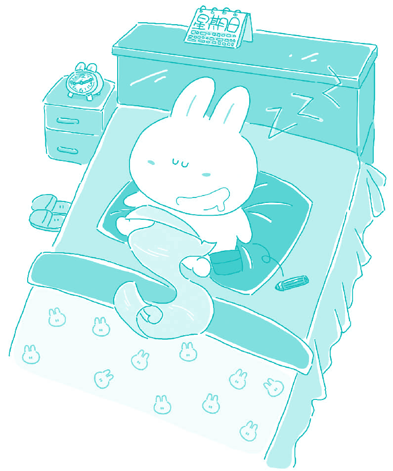

# 115. Planning or not planning for your leisure time?

Some people find it to be a better use of their free time if they plan out all of their activities very carefully. Others enjoy their free time more if they do not make any plans at all. I agree with those in the latter group, and would prefer to not be restricted to a schedule.

Above most things, I enjoy living my life spontaneously. If I decide that I want to go away for the weekend, assuming I have money and can take time off work, I will go. I am able to live my life in this manner because I never bind myself to carefully planned schedules. I make the most out of every situation I come across and always enjoy myself. Because of this, there is no need for a schedule. It is much more fun to just wait and see what will happen next, after all, it's a free time.

I always enjoy the freedom of an unplanned afternoon. If I need to get errands done, I will find time for them. If I have free time, I want to enjoy it. I do not want to be trying to finish things quickly just because there is somewhere else that might be interesting on my list of things to do. If I am at a park and am really enjoying myself, there is no reason why I should leave, even if there is something else to do on my list that sounds interesting. I believe in living in the moment. What I am doing at the present moment is more important than anything I might do in the future.

If, on a rare occasion, I do make a schedule, I find that it quickly runs off track. Perhaps I am just particularly bad at keeping to a schedule, but I find that some things take longer to do than I expected they would, and other things are finished in much shorter a time than expected. This quickly makes even the best schedule go awry.

> ## 译文
>
> **115. 对闲暇时间计划与否**
>
> 有些人发现，如果他们非常精心地把所有活动都计划好，他们的空闲时间会利用得更好。其他人则是在完全不做任何计划的情况下可以更好地享受自己的闲暇时间。我赞同后面一种人，而且也更愿意不被一个日程表所局限。
>
> 最重要的是，我喜欢顺其自然地生活。如果我决定要出去度周末，假如我有钱并且不用工作，我就会去。我能够用这种方式生活，是因为我从来不用一个精心计划好的日程来约束自己。我尽可能地享受自己碰到的每一种境遇，并且过得很愉快。正因如此，没有必要做一个日程计划。只是等着看接下来会发生什么事情是非常有趣的，毕竟，这是一段空闲的时间。
>
> 我总是喜欢享受一个下午毫无计划，自由自在。如果我需要把差事做完，我会找到时间把它们完成。如果我有空闲，我想享受这段时间。我不想拼命把事情赶完，只因为在我所列举的要做的事情当中也许还有其他什么有趣的事情。如果我在一个公园，过得非常愉快，我设有任何理由离开，即使在我的节目单上有其他什么事情听起来很有意思。我相信活在此刻。我此刻在做的事情比我将来可能要做的任何事情都更重要。
>
> 如果偶尔我的确做了一个日程安排，我发现它很快就被打乱了。也许我特别不善于遵循计划，但是我觉得有些事情需要的时间比我预期的要长，而其他一些事情需要的时间则比预期的要短很多。这使得最好的日程安排也很快就出了乱子。

## Word List

* plan out 订计划，部署
* spontaneously ［spa:nˈteinjəsli］ adv. 自然地
* assume ［əˈsu:m］ v. 假如，假定
* bind...to 把…约束在
* schedule ［ˈskedʒjul］ n. 计划表，日程表
* come across 碰到，遇到
* rare ［rεə］ adj. 罕见的，很少的
* keep to 局限于
* awry ［əˈrai］ adj. 错误的

