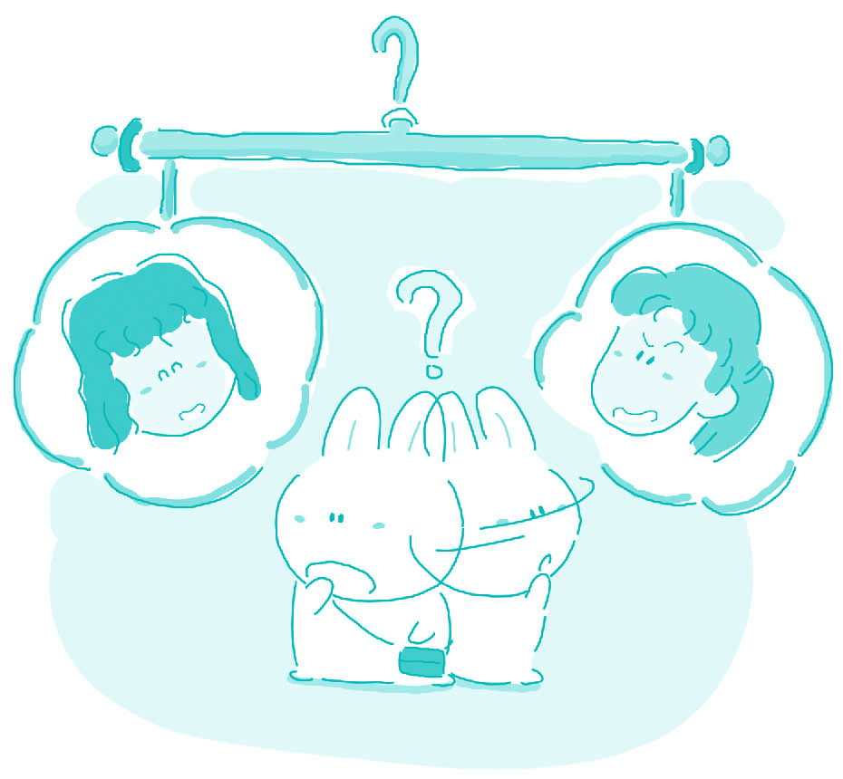

# 117. Choose friends who are different from you or similar to you?

In general, my friends are quite similar to me. There are a number of reasons as to why this is the case. When two people are similar to each other, they have a wide basis of topics available to them for conversation, and are also able to bond over many types of experiences. For example, one of my major interests is music. I frequently enjoy going to see musical acts perform. If a potential friend is not interested in the same type of music as me, we will not be able to share these experiences together. Without being able to have these bonding experiences, it is difficult for an acquaintanceship to evolve into a friendship.

Another reason why we usually choose friends who are quite similar to us is because having similar friends who have common interests can help us come up with new ideas regarding things we are interested in. If I am particularly interested in a project, but cannot seem to advance the thought to my satisfaction, it is quite likely that one of my friends will be able to offer insight on the subject that I hadn't previously thought of.

Nonetheless, it is important to consider exactly how similar one must be to me for me to form a friendship with them. I have many friends who, on the surface, are quite different from me. However, we share one or two common interests that allow us to communicate on a clear, meaningful level. To explain, I will give an example of a particular friend who fits into this category. I met this friend at the opening of a new Italian restaurant in town. We have very different interests, and very different occupations. However, we are both connoisseurs of fine cuisine. Based on this one small connection, we formed a very good friendship.

In conclusion, I find that it is possible to have friends who appear similar to or different from myself. The key to a strong, lasting friendship is finding one or two areas that both parties find interesting.

> ## 译文
>
> **117. 选择与自己不同还是与自己相似的朋友？**
>
> 通常，我的朋友都和我非常相似。为什么会这样存在很多原因。当两个人相似的时候，他们有广泛的话题可谈，同时还能凭借许多种经历联系在一起。比如，我的主要爱好之一就是音乐。我喜欢经常去欣赏音乐剧表演。如果一个有可能成为朋友的人对同类音乐不感兴趣的话，我们将不能一起分享这些经历。要是不能拥有这些起维系作用的经历，就很难从相识逐步发展成为友谊。
>
> 我们通常选择与自己类似的人作为朋友的另外一个原因就是，与自己有共同兴趣的朋友能够帮助我们发展出关于我们感兴趣事物的新观点。如果我对一个计划特别有兴趣，但却似乎无法提出令自己满意的想法，我的其中一位朋友将非常有可能就此主题提供我自己从未想到过的见解。
>
> 尽管如此，考虑好一个人必须和我有多么近似才能让我与其建立友谊是很重要的。我有许多朋友，他们外表上看起来和我非常不同。然而我们分享一两个共同的爱好，这样可以让我们在清晰而有意义的层面上进行沟通。为了解释这一点，我会以某位符合这种类型的的朋友作为例子。我是在城里一家新意大利餐厅的开张典礼上遇见这位朋友的。我们的兴趣差别很大，职业也非常不同。但是，我们都是美食鉴赏家。基于这小小的共同点，我们成了非常好的朋友。
>
> 总而言之，我发觉，拥有看似与自己相近或是不同的朋友都是有可能的。维持坚固而持久的友谊，关键在于寻找到一两处双方都觉得感兴趣的领域。

## Word List

* bond ［ba:nd］ v. 维系，联结
* acquaintanceship ［əˈkweintənsʃip］ n. 相识
* evolve ［iˈva:lv］ v. 逐步发展
* come up with 想出
* advance ［ædˈvæns］ v. 提出
* insight ［ˈinˌsait］ n. 见解，见识
* on the surface 外表上
* fit into 符合
* connoisseur ［ˌka:nəˈsə:］ n. 鉴赏家
* cuisine ［kwiˈzi:n］ n. 烹饪

