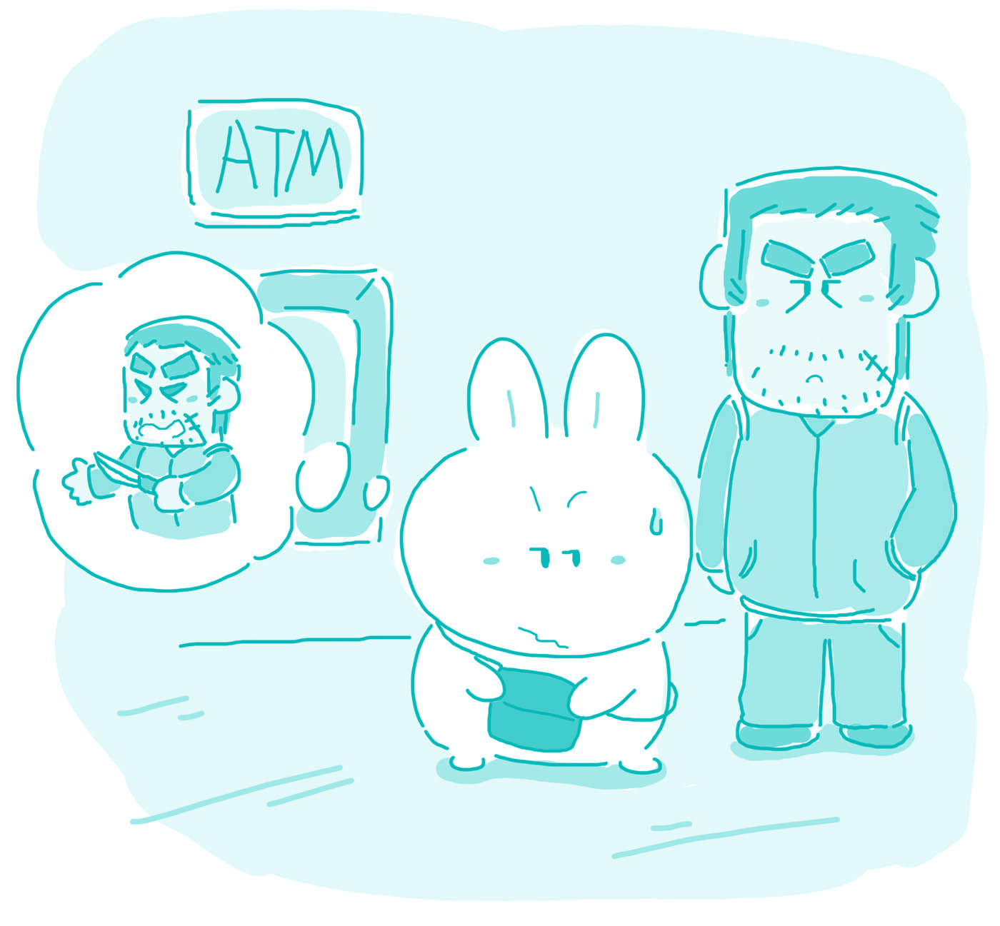

# 121. Judge people by first impressions: right or wrong?

Some people judge a person's character by first impressions simply because they believe these judgments are, for the most part, correct. Other people are warier about making judgments quickly because they believe their original impressions could be faulty. However, it's a common pattern: if someone makes a good first impression, people will be inclined to believe it, and make a judgment based on that; if the person makes a poor first impression, people will usually hold off judgment until a second or third meeting, to ensure that the original assessment was correct.

My personal philosophy for meeting new people is to give them the benefit of the doubt. If someone makes a very good first impression, I am likely to believe that that is his/her character unless, on future encounters, he/she proves it to be otherwise. I believe that this is a fair, beneficial way of making judgments. I do not think there is any reason to be suspicious of someone's character unless he/she has given me a reason to think so. It is even possible that I will make a bad first impression on someone if I am too suspicious of his/her character.

However, I also believe it is important to hold off judgment if someone makes a bad first impression. There are a multitude of reasons why someone might be in a bad mood, and therefore make a poor impression. For example, perhaps I am meeting a man who just had something bad happen to him. Perhaps his bag was stolen, and it had some important documents in it. If this happened to me, I would surely be in a bad mood, and not make a good impression on any new people I met. Therefore, I think it is important to wait until a second, or even third meeting before passing judgment.

> ## 译文
>
> **121. 凭第一印象判断人：正确还是错误？**
>
> 有些人凭借第一印象判断一个人的品质，仅仅因为他们相信这些判断大多是正确的。其他一些人对迅速做出判断则表现得更加谨慎，因为他们觉得他们最初的印象有可能是错误的。然而，这是一个普遍的模式：如果某个人留下的第一印象很好，人们将倾向于相信这种印象，并据此做出判断；而如果这个人留下的第一印象很糟，人们通常会延缓这种判断，直至第二次或第三次的见面，以确保最初的评价是正确的。
>
> 我与人初次见面的个人哲学是，在确定其好坏之前先假定是好的。如果留下的第一印象非常好，我可能会认为那是他们的品质，除非在以后的邂逅中证明他们并非如此。我相信这是做出判断的一种公平而有利的方式。我认为没有任何理由去怀疑某个人的品质，除非他或她提供了一个让我这样想的原因。如果我过分猜忌别人的品质，甚至有可能我自己会给别人留下糟糕的第一印象。
>
> 不过，我还相信，如果某个人留下的第一印象很糟，推迟做出判断也非常重要。有很多原因可以导致某个人心情糟糕，因而给人留下不好的印象。比如，我正会面的一位男士，可能在他身上刚刚发生了不好的事情。或许他的包被偷了，而里面有一些重要的文件。如果这发生在我的身上，我肯定会心情很坏，接着给我遇见的人留下不好的印象。因此，我觉得等到第二次，或者甚至是第三次见面的时候再做出判断，这也很重要。

## Word List

* impression ［imˈpreʃən］ n. 印象
* assessment ［əˈsesmənt］ n. 评价
* judgment ［ˈdʒʌdʒmənt］ n. 判断
* philosophy ［fiˈla:səfi］ n. 哲学
* original ［əˈridʒənəl］ adj. 最初的
* encounter ［enˈkauntə］ n. 邂逅，碰面
* faulty ［ˈfɔ:lti］ adj. 错误的
* suspicious ［səˈspiʃəs］adj. 怀疑的，猜忌的
* be inclined to... 倾向于
* hold off 推迟，延缓
* a multitude of 大量
* ensure ［enˈʃuə］ v. 确保

