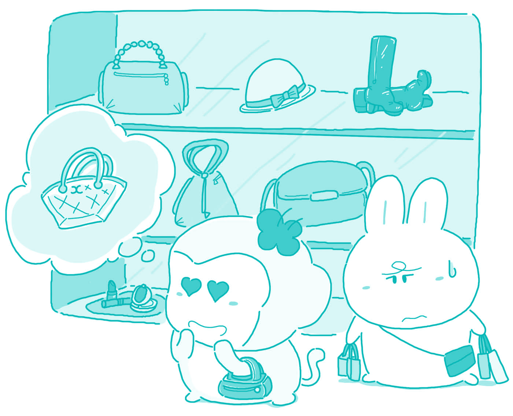

# 122. Are people never satisfied with what they have?

It is said that people are never satisfied with what they have; they always want something more or something different. Unfortunately, this statement has quite a bit of truth to it in today's society. Individuals today are constantly driven to have the best, the brightest, and the newest. With the increase of westernization, almost every country has become a consumer culture, including China.

There is not a street you can walk down in Downtown Beijing that does not have an advertisement, trying to sell you something. Wherever you go, there is a new product calling to you. Individuals in society today believe that others will not appreciate them if they do not spend exorbitant amounts of money on all types of luxuries, from cars, to fancy mobile telephones, to expensive, name brand clothing.

This idea does not only relate to consumer goods, however. I find that if I start a new job, for the first period of time, maybe the first month, the first year, or even the first five years are very exciting. Eventually, the appeal wears off, and I am no longer enchanted with my work. I crave something different, something more exciting. Anything, as long as it is better than what I am currently doing.

I think people, including myself, need to become more comfortable with their current positions. There is no reason why we should cater to the advertising industry, and constantly buy new and better products, when the ones we currently have work fine. This is not to say that we should never have new, nice things. In the past decade, consumer spending has reached new heights around the world. This is hardly necessary, especially when you consider that people have been living happily for thousands of years without such goods. I think that if people could learn to live without such frivolities, they would live a much happier life overall.

> ## 译文
>
> **122. 人们永不满足于自己所拥有的吗？**
>
> 有人说人们永远不会满足于自己所拥有的；他们总是想要更多的或是不同的东西。不幸的是，这种说法在当今的社会多少有一些真实性。现在的人受到不断的驱使去拥有最好的、最炫的和最新的。随着西化的推进，几乎每个国家都成为了一种消费文化，包括中国。
>
> 沿着北京市中心走下去，没有哪条街道上没有试图向你兜售物品的广告。无论你走到哪里，都会有一种新产品向你打招呼。现今社会的人们相信，如果他们不在各种奢侈品，从汽车，到花哨的移动电话，到昂贵的名牌服装上花费大把的钱，别人就不会欣赏他们。
>
> 然而，这种想法并不仅仅适合于消费品。我发现如果我开始一份新的工作，起初的一段时间，或者第一个月，第一年，或者甚至是开头的五年，新工作会非常令人兴奋。但最终吸引力逐渐减退，我不再对自己的工作感到着迷。我渴望不同的事情，更加令人兴奋的事情。任何事，只要它比我现在做的更好就行。
>
> 我想人们，包括我自己，需要对他们目前的状况更加知足。当我们现在所拥有的运转良好时，我们没有理由一定要去迎合广告业的需要，不断地购买新的更好的产品。这并不是说我们永远也不应该拥有新的好东西。在过去的十年中，消费支出在世界范围内已经创下了新高。这几乎是没有什么必要的，尤其当你考虑一下，人们在没有这些物品的情况下已经快乐地生活了数千年。我想如果人们能够学会在没有这些无聊东西的条件下生活，总的说来他们会生活得愉快许多。

## Word List

* westernization ［ˌwestəniˈzeiʃən］ n. 西化
* luxury ［ˈlʌgʒəri］ n. 奢侈品
* fancy ［ˈfænsi］ adj. 花哨的
* appeal ［əˈpi:l］ n. 吸引力
* wear off 减退
* enchant ［enˈtʃænt］ v. 使入迷
* crave ［kreiv］ v. 渴望
* cater to 迎合
* frivolity ［friˈva:liti］ n. 无聊的东西

