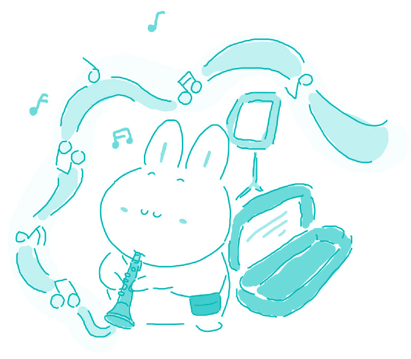

# 125. Should all students be required to study art and music in secondary school?

The authorities at secondary schools must make very important decisions regarding what will be considered to be the required curriculum for their students. I believe that art and music should be part of this required curriculum.

Studying art and music makes a person more diverse and thoughtful. When one studies art and music, one is exposed to many different cultures and points of view. It allows the audience to perceive the world through a different set of eyes. It is also an excellent way to spark interest in other cultures and diverse ways of life. This promotes understanding and tolerance of others. It is also a porthole to peer into areas of many cultures, including one's own, that one would not readily have access to. This includes everything from social life to metaphysics to philosophy, etc.

Furthermore, these subjects give the students an outlet for expressing their turbulent emotions during puberty. Art and music are also an excellent way to express emotions. In ancient times, many a troubled man turned to brush work or Chinese classical music to work out difficulties with life. Students of today'modern world have similar issues with life, and need an outlet to express these. Art and music, in any form, can assist one in dealing with personal issues.

In addition, viewing art and listening to music are excellent ways to relax. When I am stressed because of life, one of my favorite activities is painting while listening to my preferred music. I find this activity to be very soothing and calming. Looking at works of art can have a similar effect, and when one understands the philosophy behind the work, it is that much more beneficial.

Therefore, I believe that studying art and music in secondary school can be nothing but beneficial for the students. I would encourage all school districts to make these subjects part of their required curriculums.

> ## 译文
>
> **125. 中学生必须学习艺术与音乐吗？**
>
> 在考虑关于要把什么作为学生必修课程的时候，中学的负责人必须做出非常重要的决定。我认为艺术和音乐应该是这种必修课程的一部分。
>
> 学习艺术和音乐使得一个人更加多元化，也更加善于思考。当一个人学习艺术和音乐的时候，可以接触到许多不同的文化和见解。艺术和音乐让观众或听众得以从不同的角度去领悟世界。这还可以很好地激发对其他文化和各种各样生活方式的兴趣，从而增进对他人的了解和宽容。艺术和音乐还可以成为透视多种文化的通道，包括一个人自己的文化，它涵盖了从社会生活到玄学到哲学等等所有的一切。而这些是一个人本不会那么容易地接触到的。
>
> 另外，这些科目给学生们提供了表达他们青春期骚动情绪的一种途径。艺术和音乐也是宣泄情感的极佳方式。在古代，许多困惑不安的人就借助绘画或者中国古典音乐来应对生活的艰难。当今的学生，生活中有着类似的问题，也就需要一种将其表达出来的途径。艺术和音乐，无论以何种形式，都能帮助一个人处理自己所遇到的问题。
>
> 除此以外，欣赏艺术以及聆听音乐都是让自己得到放松的绝佳方式。当我感到生活的重压时，我最喜欢的活动之一就是一边画画一边听着自己钟爱的音乐。我发现这非常有助于让自己平静和镇定。欣赏艺术作品也可以有类似的功效，而且当一个人理解了作品背后的哲理，那会更加有益。

## Word List

* authority ［əˈθɔ:riti］ n. 负责人
* tolerance ［ˈta:lərəns］ n. 宽容
* regarding ［riˈga:diŋ］ prep. 关于
* porthole ［ˈpɔ:tˌhəul］ n. 通道
* curriculum ［kəˈrikjələm］ n. 课程
* peer into 透视，窥视
* diverse ［daiˈvə:s］ adj. 多元化的，各种各样的
* readily ［ˈredili］ adv. 无困难地
* metaphysics ［ˌmetəˈfiziks］ n. 玄学
* perceive ［pəˈsi:v］ v. 理解，领悟
* assist ［əˈsist］ v. 帮助
* spark ［spa:k］ v. 激发
* sooth ［su:θ］ v. 使平静
* promote ［prəˈməut］ v. 增进，促进

