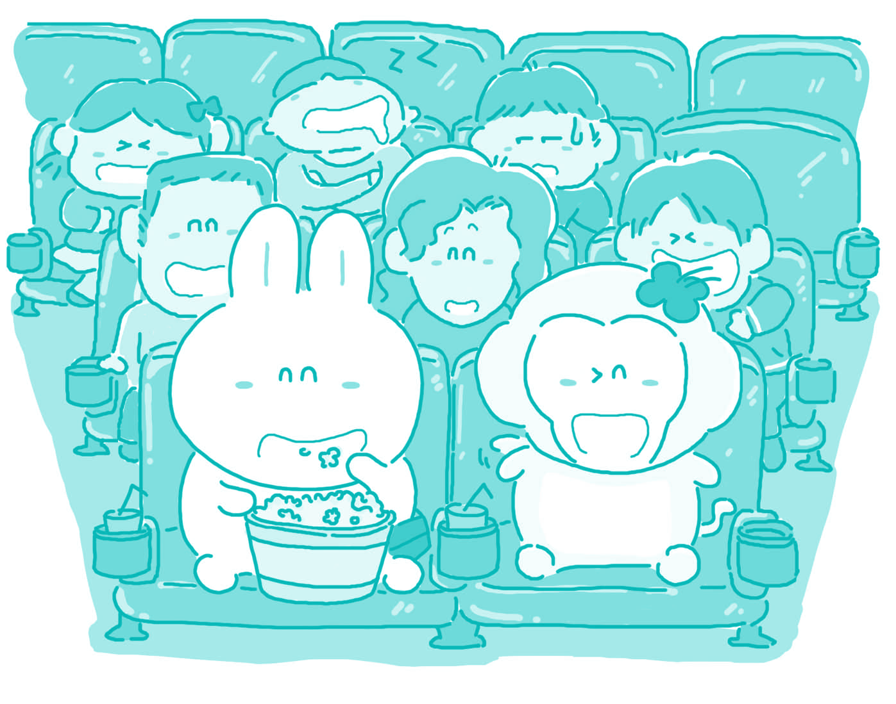

# 127. Is reading fiction more enjoyable than watching movies?

Billions of dollars are spent on entertainment every year, in every country in the world. Much of this money is spent on either movies or fictional books, as these two types of entertainment are found to be most enjoyable by the masses. Which, however, is more enjoyable? I posit that these mediums cannot be compared so easily, as they both have their strong points in regards to entertainment.

When one reads a fictional book, one is able to let his/her imagination run wild. Everything from the setting to the character descriptions is left up to the reader's mind, and therefore can be quite enjoyable. Depending on the novel, of course, one can imagine far away places just by the description read in the novel. Books are also an excellent form of entertainment as they are portable. If one is on a long commute to work, which is common in Beijing, one can bring along a favorite novel, effectively taking his/her entertainment with him/her. Books can be enjoyed in any setting. They can be picked up on a whim, and put down again to return to at a later time.

Movies, of course, also have their own benefits. Movies allow the viewer to be completely engrossed in the plot. There is no need for thinking, as everything is presented to you in a straightforward form. One never has to ponder what a place or a person looks like; the information is all accessible to the viewer. This can be an advantage or a disadvantage, depending on what one is looking for in his/her entertainment.

In a society where we want everything faster, better and more exciting, perhaps movies are a more relevant medium. However, movies demand at least an hour and a half of one's time. Books are available to their consumers whenever there is time, which is also an important feature. In conclusion, I believe that neither books nor movies are a more enjoyable form of entertainment. In some cases, I prefer to read a book. In others, a movie is vastly more enjoyable. It is up to the consumer to decide.

> ## 译文
>
> **127. 读小说是否比看电影更有趣？**
>
> 每年在世界上的各个国家有上亿美元花费在娱乐活动上。这些钱有许多是用于电影或者小说，因为大多数人都认为这两种娱乐方式是最有乐趣的。然而，哪种更有意思一些呢？我认为这些形式比较起来并不是太容易，因为它们两种作为娱乐消遣都有其各自的优势。
>
> 当一个人阅读小说的时候，他可以无限放飞自己的想象。从背景到人物性格描绘的所有一切都可以出现在读者的脑海中，因而可以非常有趣。当然，依靠小说，一个人能够仅仅通过在小说中读到的描绘想象出遥远的地方。书本是一种娱乐消遣的绝佳形式，也是由于它便于携带。如果一个人上下班路途漫长，这种情况在北京很常见，他可以随身带上一本自己喜爱的小说，实际上就是将娱乐消遣随身携带。书本能够在任何环境里欣赏。可以一时兴起拿起书本，然后再放下，等到以后回头再看。
>
> 当然，电影也有自己的好处。电影使观众完全沉浸于情节之中。没有必要思考，因为一切都以简单明了的方式呈现在你面前。人们永远不需要考虑某个地方或某个人是什么样子；所有信息观众都能获得。这可能是一个优势，也可能是一个劣势，取决于人想通过娱乐寻求什么。
>
> 在我们希望一切事物更快、更好而且更刺激的这样一个社会里，也许电影是一种更有实际价值的形式。但是，电影至少需要花费人们一个半小时的时间。而读者就可以一有时间就读书，这也是一个重要的特色。总而言之，我不认为读书和看电影哪一个比对方更有趣。在有些情况下，我更愿意读书，而在其他一些情况下，一部电影要更有意思。这要依靠当事者自己来决定。

## Word List

* setting ［ˈsetiŋ］ n. 背景
* portable ［ˈpɔ:təbl］ adj. 便携式的
* effectively ［iˈfektivli］ adv. 实际上
* on a whim 一时兴起
* engross ［enˈgrəus］ v. 使沉浸，使全神贯注
* straightforward ［streitˈfɔ:wəd］ adj. 直截了当的
* ponder ［ˈpa:ndə］ v. 考虑，思考
* accessible ［ækˈsesəbl］ adj. 可获得的，可理解的

