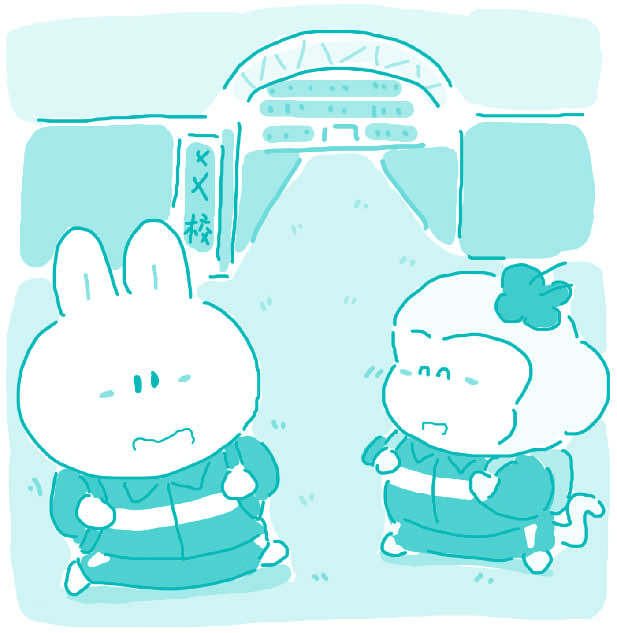

# 135. Should high schools require students to wear school uniforms or permit them to decide what to w

While in most present day high schools it is controversial that whether students should wear uniforms, most elementary schools have adopted uniform policy with wide support. Uniforms serve students benefits in several ways. First of all, uniforms act as social equalizers. Children often feel less social pressure when everyone in the school dresses the same way. Students who can not be fashionable due to limited family finances are made to feel more comfortable among their peers. Moreover, the wearing of uniforms influences students' perceptions of school climate. Students are made to feel as if they are a part of a team by wearing a uniform. School climate is improved considerably because kids perceive that they fit in because they look like everybody else. In addition, school uniforms would assist students and parents in other ways. Students would learn to appreciate the elimination of so many choices when getting dressed for a school day. Students would not be tardy for school as often because of the indecision about what to wear in the mornings.

However, when the issue comes to high school situation, further details should be carefully examined. Students in high schools are in a much different situation from students in elementary schools. High school students are sometimes called young adults, by which people are expecting their maturity, at least to some extent. It's moderate that schools are expected to operate a welldisciplined, structured environment that is conducive to learning. But uniform is not the right answer to various difficulties and problems that the high school education is confronting. For example, while proponents address the safety that uniform policy would bring, opponents are aware of the fact that campus violence would not be reduced because of uniforms. Having grown up already, most students no longer feel that uniforms help them become a part of the school. Furthermore, uniforms may not save parents as much money as many people would like to believe. Uniforms do not eliminate the need for clothing needed for outside school. Students many times don't wear their school clothing the rest of the day once they are out of school. Sneakers, jackets, boots, casual clothing, and more will still be needed. What may first appear to be economical may not be accurate in reality.

It has been said that a controversy can not exist without a fundamental dispute, and it seems that the answer to the school uniform debate is not a simple yes or no. There is no clear consensus as to the benefits of school uniforms. However, as to high schools, uniform policy should eventually be reconsidered as many other regulations which have already been eliminated including"Boys' hair should not touch collar," or "Girls' skirts must be longer than knees. "

> ## 译文
>
> **135. 中学应该要求学生穿制服，还是允许学生自行决定着装？**
>
> 如今，关于中学是否应该让学生穿校服的问题尚有争议，但大多数的小学已经在得到广泛支持的情况下采取了校服制度。学校制服可以在几方面给学生们带来好处。首先，校服可以扮演社会均衡器的角色。当学校的每个人穿相同的衣服时，孩子们经常会感觉社会压力更小。这会让那些由于家庭经济状况有限而不能穿着时髦的学生在同伴中感觉更舒服自在。而且，制服的穿着影响到学生们对学校气氛的感知。穿校服让学生们觉得他们是团队中的一部分。学校气氛可以得到相当大的改善，因为孩子们看到自己与其他人都相似而感觉很适应。另外，学校制服还会在其他方面有助于学生及其家长。学生会学会喜欢前去上课时不用再考虑繁多的着装选择。学生们还可以不再因为早晨无法决定穿什么而经常上课迟到。
>
> 然而，当问题转到中学的时候，就必须仔细考虑进一步的细节了。中学生的情况与小学生大相径庭。中学生有时被称作年轻的成年人，这种称呼体现了人们正期待着他们的成熟，至少是一定程度上的。学校应该营造一种有利于学习的有纪律、有组织的环境，这是很正常的。但是，校服并不是中学教育所面临的各种困难和问题的最佳解决方式。比如，一方面，支持者提出校服制度将会带来安全，另一方面，反对者则意识到学校暴力不会因为校服而减少的事实。大多数学生已经长大了，他们不再感觉校服可以帮助他们成为学校的一部分。而且，制服也不会像许多人愿意认为的那样，为父母节约许多钱。校服并未减少校外的衣物需求。许多时候，学生们一旦走出校门就不穿校服了。运动鞋、夹克衫、长统靴、休闲服装以及其他衣物仍然还是需要的。起初看似经济的在现实中并非如此。
>
> 有人说，如果没有根本分歧的话，争议就无法存在，而且看起来对学校制服的争论的解决办法并不是一个简单的是或不是。关于学校制服的益处没有明显的共识。然而，对于中学来说，校服制度应该像其他很多规则一样被重新考虑，这些规则包括“男孩子的头发不应长到衣领”，或者“女孩子的裙子必须长过膝盖”，他们已被废除。

## Word List

* controversial［ˌka:ntrəˈvə:ʃəl］ adj. 有争议的
* well-disciplined［ ˌwelˈdisiplind］adj.有纪律的
* uniform ［ˈju:nəˌfɔ:m］ n. 制服
* conducive ［kənˈdu:siv］ adj. 有助于…的
* equalizer ［ˈi:kwəˌlaizə］ n. 平衡器
* confront ［kənˈfrʌnt］ v. 面临
* fashionable ［ˈfæʃənəbl］ adj. 时髦的
* proponent ［prəˈpəunənt］ n. 支持者
* peer ［piə］ n. 同伴，同辈
* opponent ［əˈpəunənt］ n. 反对者
* considerably［kən ˈsidərəbəli］adv.相当大地
* sneaker ［ˈsni:kə］ n. 运动鞋
* fit in 适应
* economical ［ˌekəˈna:mikəl］ adj. 经济的
* elimination ［iˌliməˈneiʃən］ n. 消除
* consensus ［kənˈsensəs］ n. 共识，意见一致
* tardy ［ˈta:di］ adj. 迟到的

