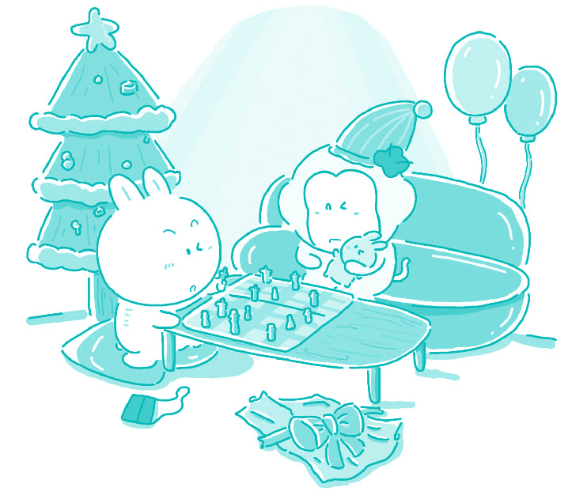

# 142. What gift would you give to help a child develop?

Child's development is often supplemented by the gifts they receive from important adults in their life. It is important to choose these gifts carefully, and foster growth in the right areas. If I were to give a gift to a child, it would be the game of chess. Chess offers a number of advantages to a child. Chess builds social skills, it encourages the child to develop the higher functions of the brain, and it is a good hobby.

As with most games, chess encourages a child to be social with others.

As chess is a two-person game, any time childrem play the game they will be interacting with others. As chess is a competitive game with a winner and a loser, children will have to learn how to lose gracefully if they hope to keep their chess partners. Building social skills when one is young is very important for future successes throughout one's life.

Playing chess is also an excellent way to increase one's thinking abilities. Chess is a game of strategy. When playing chess, a child will build important skills such as pattern recognition, strategic thinking, and analytical thinking. All of these skills are very important, especially when going through school. Many subjects a young person must take in school utilize all of these skills, and working on them early in life can be nothing but beneficial.

Finally, chess is an excellent hobby for a young person. Playing chess, or any other time-intensive game, keeps children out of trouble. If they are spending their time working on building their chess strategies, they are not out on the streets causing trouble. Many children develop behavioral problems because of simple boredom. Chess is an excellent remedy for this, as it is fun to spend one's free time.

Thus, I think chess is an excellent present to give to a young child. Chess encourages both personality and mental development, which are very important in a child's early years. While many gifts will encourage the maturity of one of these types of development, there are few gifts that foster the development of both.

> ## 译文
>
> **142. 你会给儿童什么玩具以助其成长？**
>
> 小孩子从对他们生命至关重要的成年人那里得到的礼物经常可以辅助他们成长。精心挑选这些礼物，并鼓励在恰当领域的发展，这是非常重要的。如果我要送一份礼物给一个孩子的话，它会是国际象棋。国际象棋对孩子来说有很多益处，它能培养社交能力，鼓励孩子发展更高水平的思维，而且它还是一个很不错的业余爱好。
>
> 就像大多数游戏一样，国际象棋鼓励孩子与其他人交往。因为国际象棋是一个双人游戏，因此只要一玩游戏，他们就会与其他人互相影响。而且国际象棋是一个有胜者和败者的竞赛性游戏，如果孩子们希望维系与他们的国际象棋玩伴的友谊，他们就不得不学习如何优雅地失败。一个人年轻的时候培养社交能力对他未来一生中的成功是极其重要的。
>
> 玩国际象棋还是增强人思维能力的一种很好的方式。国际象棋是一种策略游戏。下国际象棋的时候，一个孩子将会培养重要的技能，比如套路识别，策略思考和分析思维。所有这些技能都是很重要的，尤其是对上学来说。一个年轻人在学校必须参与的许多学科都要使用到所有这些技能，而早年培养它们是有利无弊的。
>
> 最后，国际象棋是年轻人一种非常不错的业余爱好。下国际象棋，或者其他任何时间密集型的游戏，都可以让孩子们远离麻烦。如果他们把时间花费在培养国际象棋策略上，他们就不会在外面的街道上制造麻烦。许多孩子只是由于无聊而产生行为问题。对此，国际象棋是一种很好的补救方法，因为它是一个人度过闲暇的非常有意思的方式。
>
> 因此，我认为国际象棋是送给孩子的一份绝佳的礼物。国际象棋既鼓励个性的发展，也促进思维的发展，而这在孩子的早年是极其重要的。虽然许多礼物都会促进某一方面的发展，但很少有礼物可以同时帮助两者的发展。

## Word List

* supplement ［ˈsʌpləmənt］ v. 辅助
* behavioral ［biˈheivjərəl］ adj. 行为的
* foster ［ˈfɔ:stə］ v. 培养
* boredom ［ˈbɔ:dəm］ n. 无聊
* hobby ［ˈha:bi］ n. 业余爱好
* remedy ［ˈremidi］ n. 补救法
* gracefully ［ˈgreisfəli］ adv. 优雅地
* personality ［ˌpə:səˈnæliti］ n. 个性
* utilize ［ˈju:tlˌaiz］ v. 使用
* maturity ［məˈtjuəriti］ n. 成熟
* intensive ［inˈtensiv］ adj. 密集的

