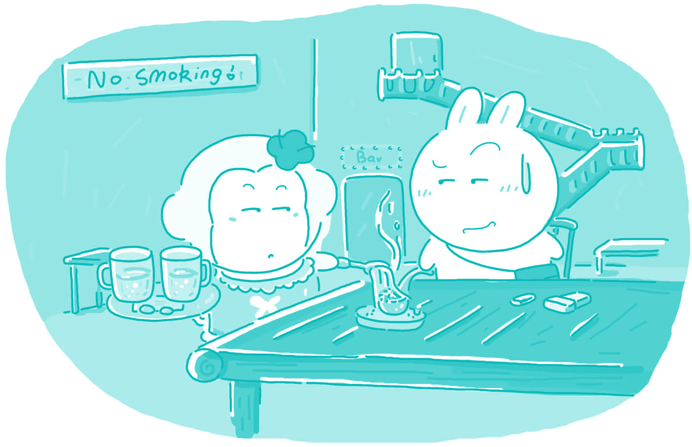

# 154. Is banning smoking in public places a good rule or a bad rule?

In spite of all of the known dangers of smoking, people all over the world continue to indulge in this terrible habit. By allowing people to partake in a cigarette whenever they please, the government is encouraging the smokers' early death. Smoking should be made illegal in all public places as it is very dangerous to one's health, it endangers the life of people who must work in smoky environments, and it makes it difficult for smokers to cut down on their nicotine intake, as they can smoke everywhere.

As mentioned above, there are a vast number of illnesses caused by cigarette smoke. The major disease caused by smoking is lung cancer. This particular type of cancer alone kills more people each year than any other illness. Not only is it associated with lung cancer, it is also associated with heart disease, birth defects and a host of other disorders. On a more aesthetic level, smoking yellows one's teeth and hands, which makes him unattractive. Most people also find the smell of a smoker to be undesirable.

It is not only the smoker himself who is injured by his habit. People who must work in smoky environments, such as barmaids and waiters, are susceptible to all of the above-mentioned ailments. Also, the children and spouse of a smoker will be affected by the constant smoke in their environment, and will also be adversely affected. It is unfair for people to suffer for other's bad habits. If one could only smoke in the privacy of one's home, many lives would be saved.

Finally, it is important to disallow smokers to smoke in public because doing so increases their likelihood of smoking often. If a person must go into a private area to smoke, they would be less likely to do so. It is an inconvenience, and the smoker would therefore partake in a cigarette less often. In many places in the world, it is very cold in the winter. If a person had to smoke outside in these conditions, they would be far less likely to do so. This would eventually make it easier for the smoker to quit the habit.

Therefore, I believe that it would be beneficial for everyone if smokers were only allowed to have a cigarette while in private smoking areas. Enforcing this rule would save thousands of lives, and would also decrease the amount spent on health care dramatically.

> ## 译文
>
> **154. 公共场合禁烟是好还是坏？**
>
> 尽管大家都知道吸烟的危险性，世界各地的人们还是继续沉湎于这个可怕的习惯。政府允许人们随心所欲地吸烟，其实就是在鼓励他们过早死亡。在公共场合吸烟应该是非法的，因为这对人们的健康极其有害，它会把那些必须在烟雾缭绕环境里工作的人们的生命置于危险之中；而且因为可以随时随地吸烟，对于吸烟者来说减少尼古丁的摄入量就更为困难。
>
> 如上所述，吸烟会引起多种疾病。由吸烟引起的主要疾病就是肺癌。每年因为这种癌症的致死人数，比因为患其他所有的疾病致死的人数还要多。除了肺癌之外，吸烟还会导致心脏病、先天缺陷和其他的紊乱。从审美层次上来说，吸烟会把牙齿和手熏黄，从而使人不受欢迎。而且绝大多数人都发现吸烟者身上有令人不快的气味。
>
> 不仅吸烟者本人，就连不得不在烟雾缭绕的环境中工作的人们——比如酒吧女招待和服务员，都会患上各种各样刚才提到的疾病。而且吸烟者的孩子们和配偶也会因为生活环境中持续不断的烟雾而得病。让人们因为别人的恶习而遭受痛苦是不公平的。如果人们只有在家中独处时才能吸烟，就能挽救很多人的生命。
>
> 最后，禁止吸烟者在公共场合吸烟很重要，是因为这样会降低他们吸烟的频率。如果只有在独处的时候才能吸烟，人们就不会经常吸烟。吸烟者会因为嫌麻烦而少抽烟。世界上很多地方的冬天都很寒冷，在这种情况下如果只有在室外才能吸烟，很多人就不会这样做了。这会逐渐让戒烟变得更容易。

## Word List

* indulge in 沉湎于
* susceptible ［səˈseptəbəl］ adj. 易得病的
* partake ［pa:ˈteik］ v. 享受
* ailment ［ˈeilmənt］ n. 疾病
* nicotine ［ˈnikəˌti:n］ n. 尼古丁
* inconvenience ［ˌinkənˈvi:njəns］ n. 麻烦
* aesthetic ［esˈθetik］ adj. 审美的
* dramatically ［drəˈmætikəli］ adv. 引人瞩目地
* barmaid ［ˈba:ˌmeid］ n. 酒吧女招待

