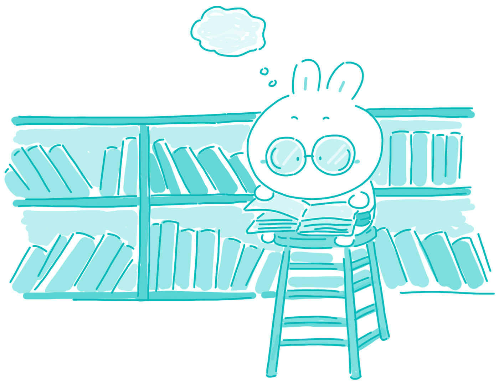

# 163. Is literacy more important today than in the past?

As the world becomes smaller and smaller due to the process of globalization, it becomes more and more important that everyone learns how to read and write. If one is to keep up with the fast pace of the world, literacy skills are of utmost importance.

Technology is expanding at an ever-increasing rate. Computers, and the Internet, have become common terms in almost all nations in the world. If one wants to be able to communicate with others using this efficient method, one must learn the basics of reading and writing. The objects we have in our home are also becoming increasingly more complicated. For example, if one wants to use a DVD player with their television, one must be able to read the manual to learn how to work it. Even the most basic technologies come with an instruction guide: if one is unable to read, they will constantly be struggling to figure out how to work these technologies. As mentioned above, the world is becoming much smaller. More people are finding it necessary to leave their homes in small towns and villages, moving to the big cities where there is more opportunity. Some of these people find it quite difficult to navigate around the city, as one must know how to read in order to understand the street signs. If one cannot find the place where one has to report for work, it would be very difficult to make a living.

Finally and perhaps most importantly, being able to read and write gives us the opportunity to think for ourselves. Wherever we are, people in authority positions tell us what we should believe. However, in many cases, it is not in our best interest to follow the leader's ideas. People must learn to read and then examine the information for themselves. This is the only way that culture can evolve.

Therefore, I think the skills of reading and writing are of vast importance, no matter where one lives in the world. The world population will continue to grow, and the only way to keep ahead is to learn to read and write.

> ## 译文
>
> **163. 读写能力今天比过去更重要吗？**
>
> 随着全球化的进程，世界变得越来越小，因此对每个人来说学会阅读和写作都变得越来越重要。如果想要跟上世界的快节奏，读写能力是极其重要的。
>
> 科学技术正在以不断加快的速度发展。电脑和互联网已经成为世界上几乎所有国家中的普及术语。如果一个人想和别人用这种高效率的方式交流，他就必须学习基本的阅读和写作。我们在家中使用的物品也变得越来越复杂了。例如，如果一个人想在电视机上连接使用DVD播放机，他就必须能够读懂使用指南，学会如何操作。即使是最基本的科技产品也有使用说明：如果一个人不会阅读，他就得经常去努力弄懂如何使用这些科技产品。
>
> 如上所述，世界变得越来越小。越来越多的人发现必须离开他们居住的小镇或者村庄，搬到有着更多机会的大城市里去。他们中的有些人发现在城市里认路相当困难，因为要读懂街道标识必须具备阅读能力。如果一个人找不到他工作应该前去报道的地点，那么就很难谋生。
>
> 最后，而且可能也是最重要的，能够阅读和写作给了我们反思自己的机会。无论我们身处何种层次，权威人士都会告诉我们应该相信什么。然而，在很多情况下，遵循领导的想法对于我们自己并不一定是最有利的。人们必须学会阅读，并且自己去调查信息。这也是文明能够发展的惟一方式。
>
> 因此，我认为一个人无论生活在世界的哪个角落，掌握阅读和写作能力都非常重要。世界人口还在不断地增长，让自己保持领先的惟一方法就是学会阅读和写作。

## Word List

* due to 因为
* instruction ［inˈstrʌkʃən］ n. 指示；用法说明
* process ［prəˈses］ n. 过程
* globalization ［ˌgləubəlaiˈzeiʃən］ n. 全球化
* navigate ［ˈnæviˌgeit］v. 驾驶
* make a living 谋生
* literary ［ˈlitəˌreri］ adj. 文化的；文学的
* authority ［əˈθɔriti］ n. 权威
* complicated ［ˈka:mpliˌkeitid］ adj. 复杂的
* evolve ［iˈva:lv］ v. （使）
* 发展
* manual ［ˈmænjuəl］ n. 手册；指南
* population ［ˌpa:pjəˈleiʃən］ n. 人口

