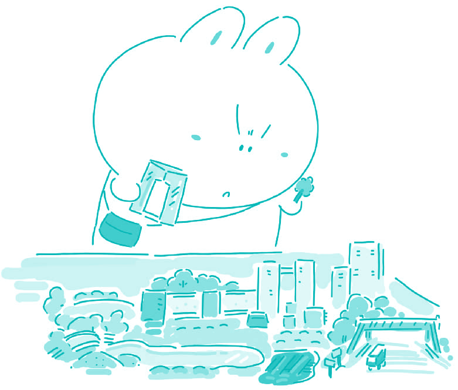

# 181. Land in your country: needs to be left in its natural condition or needs to be developed?

With a population accounting nearly for one quarter of the world population, my country, China, has been suffering from serious loss of arable land, which now hardly accounts for 7% of overall arable land of the world. Yet some people simply do not realize that land loss is so crucial that we one day might incapable of averting that catastrophe if we now close our eyes to it.

Industrial development without careful consideration regarding land preservation has caused problems more serious than people can ever imagine. Take the great Three Gorges dam for example, which will be put into operation next year. While the country benefits from gargantuan potential of electricity generation, we have to face up to various environmental conservation issues concerning geological and ecological environment along both river sides and whole upper reaches. The professional designers of the great dam now have to work out a practical way to prevent and remedy pollution effectively, which has already been the focus of world attention.

After the entrance of the WTO, industry development is more and more important for our country, yet we should be careful about the pollution which is inevitably caused by industry. Recent surveys have shown that refuse treatment engineering is not well financed in China, while attentions are drawn to those much more obvious achievements. Industrial pollution accidents occur far more frequently in our still developing country than in other more advanced countries. Urban population also produce astoundingly large amount of pollution. Today the alleged white pollution is creeping all over the country—people throw plastic bags, films everywhere, never feeling anything wrong.

We no doubt need land either for natural condition or for industry, and it seems we need more if possible. Nevertheless, we live in a world where everything has its cost, and some day in the future, I believe, we will inescapably pay for what we have ignored.

> ## 译文
>
> **181. 贵国的土地：保持原貌还是加以开发？**
>
> 我的祖国——中国的人口占世界总人口近四分之一，耕地面积却刚刚占到全世界耕地面积的百分之七，因此长期遭受到严重缺乏耕地的影响。但是，有些人却并没有意识到水土流失情形的严峻，如果我们现在对此视而不见，那么有一天我们可能会无法逆转这个灾难性的局面。
>
> 工业的发展忽视了对水土的保持，因此造成了严峻的水土问题，严峻程度甚至让人难以想象。拿明年将投入运行的三峡大坝为例，尽管国家将从水坝巨大的发电能力中获得利益，但是我们将不得不去面对可能出现在沿河和整个上游地区的各种各样的地质和生态环境问题。大坝的设计专家目前不得不设计出一个实际可行的方案，来有效阻止和补救环境破坏，这已经成为了全世界关注的焦点。
>
> 加入世界贸易组织之后，工业的发展对我们国家越来越重要，但同时我们应当警惕工业发展势必造成的污染。最近的调查显示，国家对废物处理工程的投入资金不够，而把更多的注意力都放在了那些容易获得明显成果的项目中去了。比起那些更为发达的国家，工业污染在我们这样的发展中国家发生得更为频繁。此外城市人口也造成了大量的污染。今天，人们所说的白色污染正在全国蔓延开来——人们随处丢弃塑料袋和胶卷，并且一点不觉得自己做错了。
>
> 无论是为了自然环境还是为了工业发展，毫无疑问我们都需要土地，而且如果可能的话应该需要更多。但是，我们生存的世界中一切都有其代价，将来的某一天，我想我们会无可回避地为我们所忽视过的问题付出代价。

## Word List

* arable ［ˈærəbəl］ adj. 适合耕种的
* geological ［dʒiəˈla:dʒikəl］ adj. 地质的
* account for 占
* ecological ［ˌekəˈla:dʒikəl］ adj. 生态的
* crucial ［ˈkru:ʃəl］ adj. 至关紧要的
* remedy ［ˈremidi］ v. 补救
* incapable ［inˈkeipəbəl］ adj. 无能力的
* WTO 世界贸易组织
* avert ［əˈvə:t］ v. 转变
* inevitably［ ˌinˈevitəbəli］ adv.不可避免地
* catastrophe ［kəˈtæstrəfi］ n. 大祸
* refuse treatment 垃圾处理
* preservation ［ˌprezə:ˈveiʃən］ n. 保存
* creep ［kri:p］ v. 蔓延
* gargantuan ［ga:ˈgæntuən］ adj. 巨大的
* inescapably ［ˌiniˈskeipəbəli］ adv. 无法逃避地
* potential ［pəˈtenʃəl］ adj. 潜在的
* electricity generation 发电

